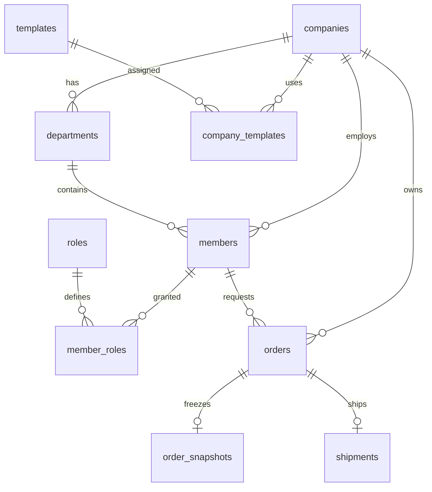

# NCMS PostgreSQL 설계서 (MVP 간소화 버전)

| 항목 | 내용 |
|---|---|
| 문서 버전 | v0.3 (MVP 간소화) |
| 작성일 | 2026-07-25 |
| 기준 문서 | `docs/requirements/ncms-functional-spec-v0.1.md` |
| DBMS | PostgreSQL 15 이상 |
| 마이그레이션 | Spring Boot + Flyway |
| DDL 위치 | `backend/src/main/resources/db/migration/V1__create_initial_schema.sql` |

---

## 1. 설계 결론 (핵심 10개 테이블)

1차 MVP 개발의 신속성과 명확성을 위해 기존 31개 스키마를 **핵심 10개 테이블**로 간소화합니다.

1. **`companies`**: 고객사 정보, 사이트 코드(`site_code`), 브랜딩(로고, 색상)
2. **`departments`**: 고객사별 부서
3. **`members`**: 사용자(임직원, 기업관리자, 로그컴운영자, 시스템관리자)
4. **`roles` / `member_roles`**: 사용자 역할 권한 (문자열 역할 코드 PK 및 역할 상세 설명 `description` 포함)
5. **`templates`**: 명함 템플릿 기본 정보 (앞/뒷면 배경, 기본 필드 설정)
6. **`company_templates`**: 고객사별 배정된 템플릿
7. **`product_options`**: 명함 재질 및 주문 수량 옵션
8. **`orders`**: 주문 기본 정보, 통합 상태(`status`), 수령인 배송지, 반려 사유, 송장 정보
9. **`order_snapshots`**: 주문 당시 명함 입력 문구(`jsonb`) 및 스냅샷 파일 키
10. **`shipments`**: 택배사, 송장번호, 배송 상태

---

## 2. 핵심 ERD

---

## 3. 주요 테이블 스키마 정의

### 3.1 `companies` (고객사)
- `id` (VARCHAR(50), PK, 예: `C_1`, `C_2`)
- `site_code` (VARCHAR, UNIQUE) - URL 세그먼트용 (예: `kakao`, `samsung`)
- `name` (VARCHAR) - 회사명
- `logo_url` (VARCHAR) - 로고 이미지 경로
- `primary_color` (VARCHAR) - 대표 HEX 색상 (예: `#FEE500`)
- `status` (VARCHAR) - `ACTIVE`, `INACTIVE`
- `created_at`, `updated_at` (TIMESTAMPTZ)

### 3.2 `members` (회원)
- `id` (VARCHAR(50), PK, 예: `M_1`, `M_2`)
- `company_id` (VARCHAR(50), FK, NULLable - 내부 운영자는 NULL 가능)
- `department_id` (VARCHAR(50), FK, NULLable)
- `username` (VARCHAR, UNIQUE) - 로그인 아이디
- `password` (VARCHAR) - Encoded 비밀번호
- `name` (VARCHAR) - 이름
- `email`, `phone` (VARCHAR)
- `status` (VARCHAR) - `ACTIVE`, `INACTIVE`
- `created_at`, `updated_at` (TIMESTAMPTZ)

### 3.2.1 `roles` (역할 기준 정보) & `member_roles` (회원-역할 매핑)
- **`roles`**:
  - `id` (VARCHAR(50), PK) - 역할 고유 코드 (`ROLE_SYSTEM_ADMIN`, `ROLE_COMPANY_ADMIN`, `ROLE_EMPLOYEE`, `ROLE_OPERATOR`)
  - `name` (VARCHAR(50)) - 역할명 (예: `시스템 관리자`)
  - `description` (VARCHAR(255)) - 역할 상세 설명 및 권한 범위
- **`member_roles`**:
  - `member_id` (VARCHAR(50), FK, PK) - 회원 ID
  - `role_id` (VARCHAR(50), FK, PK) - 역할 ID (`roles.id`)

### 3.3 `orders` (주문)
- `id` (VARCHAR(50), PK, 예: `O_1`, `O_2`)
- `order_no` (VARCHAR, UNIQUE) - 주문번호 (당일 기준 4자리 순차 일련번호 패턴, 예: `ORD-20260729-0001`, `ORD-20260729-0002`)
- `company_id` (VARCHAR(50), FK) - 주문 고객사 ID (`C_1`)
- `member_id` (VARCHAR(50), FK) - 주문자 ID (`M_1`)
- `template_id` (VARCHAR(50), FK) - 선택 템플릿 ID (`T_1`)
- `status` (VARCHAR) - `PENDING`, `APPROVED`, `REJECTED`, `PRINTING`, `SHIPPED`, `DELIVERED`, `CANCELLED`
- `recipient_name`, `recipient_phone`, `zipcode`, `address`, `address_detail` (VARCHAR) - 수령지 정보
- `reject_reason` (TEXT) - 반려 시 사유
- `created_at`, `updated_at` (TIMESTAMPTZ)

### 3.4 `order_snapshots` (주문 명함 데이터 스냅샷)
- `id` (VARCHAR(50), PK, 예: `S_1`, `S_2`)
- `order_id` (VARCHAR(50), FK, UNIQUE) - 주문 ID (`O_1`)
- `card_data` (JSONB) - 주문 시 입력한 명함 문구 (한글/영문 이름, 부서, 직급, 전화번호 등)
- `product_option_summary` (VARCHAR) - 재질명, 주문 수량 등 옵션 요약
- `preview_front_url`, `preview_back_url` (VARCHAR) - 미리보기 이미지 식별자
- `print_pdf_url` (VARCHAR) - 인쇄용 PDF 파일 식별자
- `created_at` (TIMESTAMPTZ)

### 3.5 `shipments` (배송 정보)
- `id` (VARCHAR(50), PK, 예: `SHP_1`, `SHP_2`)
- `order_id` (VARCHAR(50), FK, UNIQUE) - 주문 ID (`O_1`)
- `carrier_code` (VARCHAR) - 택배사 코드
- `tracking_number` (VARCHAR) - 송장번호
- `shipped_at` (TIMESTAMPTZ) - 발송일시

### 3.6 `product_options` (명함 상품 옵션)
- `id` (VARCHAR(50), PK, 예: `OPT_P1`, `OPT_Q1`)
- `category` (VARCHAR(20)) - 옵션 카테고리 (`PAPER`: 사양/재질, `QTY`: 수량)
- `name` (VARCHAR(100)) - 옵션 표기명 (예: `휘라레 216g`, `200매`)
- `sort_order` (INT) - 노출 순서
- `status` (VARCHAR(20)) - 활성 상태 (`ACTIVE`, `INACTIVE`)
- `created_at`, `updated_at` (TIMESTAMPTZ)

---

## 4. 데이터 모델링 특징
- **PK**: 식별자는 직관적이고 관리가 편리한 `VARCHAR(50)` (예: `C_1`, `T_1`, `M_1`, `O_1`) 사용.
- **명함 데이터 저장**: 유동적인 명함 필드는 `order_snapshots.card_data` (`jsonb`)로 저장하여 유연성 확보.
- **단순화된 이력 관리**: 별도 감사/타임라인 테이블 대신 `orders` 컬럼(`status`, `reject_reason`, `updated_at`)과 `shipments`로 핵심 흐름 관리.

---

### 3.11 DB 마이그레이션 히스토리 (Flyway)
- **`V1__create_initial_schema.sql`**: 10개 핵심 테이블 DDL 초기화.
- **`V2__seed_reference_data.sql`**: 기초 데이터 및 참조 역할 코드 생성.
- **`V3__add_sample_dummy_orders.sql`**: 샘플 주문 및 스냅샷 더미 데이터 추가.
- **`V4__add_pending_dummy_orders.sql`**: 승인대기 샘플 주문 추가.
- **`V5__add_hanmiglobal_and_templates.sql`**: 한미글로벌 및 제일엔지니어링 템플릿/계정 추가.
- **`V6__add_auto_increment_sequences.sql`**: `members`, `orders`, `order_snapshots` 테이블의 `VARCHAR` PK를 유지하면서 숫자로만(`'1'`, `'2'`, `'3'`...) 자동 채번(Auto Increment)되는 DB 시퀀스(`members_id_seq`, `orders_id_seq`, `order_snapshots_id_seq`) 및 `DEFAULT` 생성.
