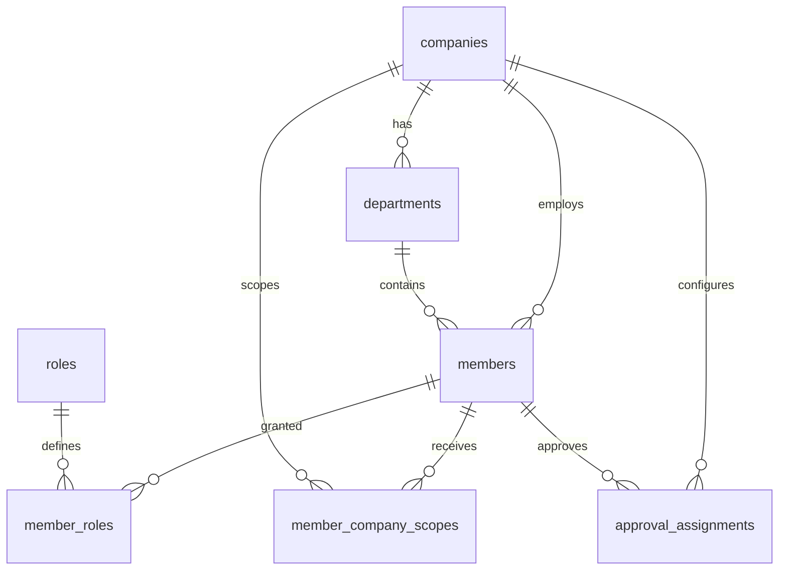
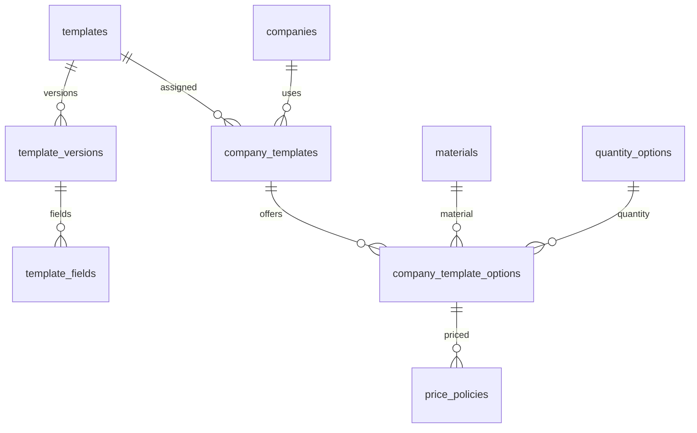
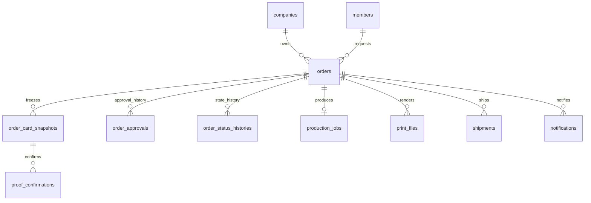

# NCMS PostgreSQL 설계서

| 항목 | 내용 |
|---|---|
| 문서 버전 | v0.2 |
| 작성일 | 2026-07-22 |
| 기준 문서 | `docs/requirements/ncms-functional-spec-v0.1.md` |
| DBMS | PostgreSQL 15 이상 |
| 배포 | Railway PostgreSQL |
| 마이그레이션 | Spring Boot + Flyway |
| DDL | `backend/src/main/resources/db/migration/V1__create_initial_schema.sql` |
| 기준데이터 | `backend/src/main/resources/db/migration/R__seed_reference_data.sql` |

## 1. 설계 결론

초기 스키마는 31개 테이블로 구성한다. 핵심 구조는 다음 네 가지다.

1. 모든 기업 업무 데이터는 `company_id`를 기준으로 격리한다.
2. 승인 상태와 제작 상태를 `orders`에서 별도 컬럼으로 관리한다.
3. 템플릿은 수정할 때 덮어쓰지 않고 `template_versions`에 새 버전을 만든다.
4. 주문 당시 화면·문구·템플릿·상품·가격은 `order_card_snapshots`에 고정한다.

DB에는 검색·정렬·권한 검증에 필요한 데이터는 정형 컬럼으로 저장하고, 템플릿 배치 정보와 주문 당시의 유동적인 명함 필드는 `jsonb`로 저장한다. 이미지와 PDF 원본은 DB 바이너리로 넣지 않고 파일 저장소에 보관하며 DB에는 파일 키, 해시, 버전과 메타데이터만 저장한다.

## 2. 범위와 전제

### 2.1 이번 DDL에 포함

- 고객사·부서·회원·역할·고객사 접근범위
- 회사 또는 부서 단위 승인자 지정
- 로그인 유지 토큰·비밀번호 초기화·로그인 이력
- 명함 템플릿·템플릿 버전·편집 필드
- 고객사별 템플릿·재질·수량·가격 정책
- 주문·재주문·중복 요청 방지
- 주문 명함 스냅샷·교정 확인
- 승인·반려·재상신 및 상태 이력
- 제작 작업·인쇄 파일 버전·다운로드 이력
- 배송·송장과 변경 이력
- 이메일 템플릿·발송 큐·실패 재시도
- 감사 로그

### 2.2 후속 마이그레이션으로 분리

기능정의에서 2차 범위인 다음 기능은 실제 정책 확정 후 별도 DDL로 추가한다.

- 토스페이먼츠 결제·취소
- 고객사별 월 정산·미납 관리
- 엑셀 대량 주문의 업로드 작업과 행별 오류 저장
- 택배사 API 원문 이벤트 저장
- 일반 고객·비회원 주문

가격 컬럼과 `price_policies`는 1차 화면에서 가격을 숨겨도 데이터 구조를 다시 바꾸지 않도록 선반영했다. 값은 정책 확정 전까지 `NULL`로 둘 수 있다.

## 3. 핵심 ERD

### 3.1 고객사·회원·권한



기업 임직원과 기업 관리자는 `members.company_id`가 필수다. 로그컴 운영자와 시스템 관리자는 `company_id` 없이 내부 계정으로 만들 수 있으며, 일부 고객사만 담당할 경우 `member_company_scopes`로 접근 범위를 지정한다.

### 3.2 템플릿·상품



`templates`는 템플릿의 영속 식별자이며, 실제 디자인과 필드는 `template_versions`와 `template_fields`가 가진다. 신규 버전을 발행할 때 기존 `PUBLISHED` 버전을 `RETIRED`로 바꾸고 새 버전을 `PUBLISHED`로 전환한다.

### 3.3 주문·제작·배송



`orders`에는 현재 상태를 두어 목록 조회를 빠르게 하고, 모든 변경은 별도 이력 테이블에 누적한다. 현재값과 이력은 같은 트랜잭션에서 함께 변경해야 한다.

## 4. 테이블 구성

| 영역 | 테이블 | 목적 |
|---|---|---|
| 고객사 | `companies` | 고객사 기본정보, 유일 사이트 코드(경로 `/{고객사코드}` 라우팅용), 승인·배송·가격 노출 정책 |
| 고객사 | `departments` | 고객사별 계층형 부서 |
| 계정 | `members` | 임직원·기업 관리자·운영자·시스템 관리자 |
| 권한 | `roles`, `member_roles` | 역할 기준정보와 회원 역할 |
| 권한 | `member_company_scopes` | 내부 운영자의 담당 고객사 범위 |
| 승인 설정 | `approval_assignments` | 회사·부서 단위 승인자 (현재 고객사 내부 승인 미사용, 후속 정책용 보류) |
| 인증 | `auth_refresh_tokens` | 해시된 리프레시 토큰과 폐기 정보 |
| 인증 | `password_reset_tokens` | 일회용 비밀번호 초기화 토큰 |
| 인증 | `login_histories` | 성공·실패·잠금 로그인 이력 |
| 상품 | `materials`, `quantity_options` | 재질과 수량 기준정보 |
| 템플릿 | `templates` | 템플릿 기본 식별자 |
| 템플릿 | `template_versions` | 실제 디자인 버전과 배경 파일 |
| 템플릿 | `template_fields` | 필드 위치·크기·폰트·검증 설정 |
| 고객사 상품 | `company_templates` | 고객사 사용 가능 템플릿 |
| 고객사 상품 | `company_template_options` | 템플릿별 재질·수량 조합 |
| 가격 | `price_policies` | 기간별 계약 가격 |
| 주문 | `orders` | 주문 현재값과 수령·금액 정보 |
| 주문 | `order_card_snapshots` | 주문 당시 명함·템플릿·상품·가격 |
| 교정 | `proof_confirmations` | 오탈자·연락처·디자인 확인과 무효화 |
| 승인 | `order_approvals` | 상신·재상신·승인·반려 이력 |
| 상태 | `order_status_histories` | 승인 및 제작 상태 변경 이력 |
| 제작 | `production_jobs` | 제작 담당자·시작·완료·취소 |
| 파일 | `print_files` | 미리보기·인쇄 PDF 버전과 해시 |
| 파일 | `print_file_downloads` | 인쇄 파일 다운로드 감사 이력 |
| 배송 | `shipments` | 배송방법·택배사·송장·배송 상태 |
| 배송 | `shipment_histories` | 송장 수정과 배송 상태 변경 이력 |
| 알림 | `notification_templates` | 공통 또는 고객사별 이메일 템플릿 |
| 알림 | `notifications` | 발송 큐·수신자·결과·재시도 |
| 감사 | `audit_logs` | 관리자 변경 전후 데이터와 요청 정보 |

## 5. 주요 데이터 모델 결정

### 5.1 PK는 UUID

- API에서 순차 ID 노출을 피한다.
- 프론트·백엔드에서 새 객체 식별자를 안전하게 다룰 수 있다.
- PostgreSQL `gen_random_uuid()`를 기본값으로 사용한다.
- 대용량 순차 기록인 로그인·승인·상태·다운로드·감사 이력은 저장 효율을 위해 `bigint identity`를 사용한다.

### 5.2 시간은 `timestamptz`

DB에는 시각을 `timestamptz`로 저장하고, 화면에서 `Asia/Seoul`로 변환한다. 주문번호 날짜는 한국 영업일 기준으로 생성한다.

### 5.3 명함 데이터는 정형 컬럼과 JSONB 혼합

명함마다 노출 필드와 필드 키가 달라질 수 있으므로 모든 명함 항목을 주문 테이블의 고정 컬럼으로 만들지 않는다.

`order_card_snapshots.card_data` 예시:

```json
{
  "koreanName": "홍길동",
  "englishName": "Gildong Hong",
  "department": "영업1팀",
  "position1": "팀장",
  "mobile": "010-1234-5678",
  "email": "gildong@example.com"
}
```

`template_data`에는 주문 당시의 필드 좌표·폰트·배경 파일 식별자를 넣고, `product_data`에는 재질명과 수량을 넣는다. `content_hash`는 스냅샷과 교정·인쇄 파일의 일치 여부를 검증하는 SHA-256 값이다.

### 5.4 파일은 외부 저장소

`front_preview_file_key`, `storage_key`에는 Railway Volume 또는 S3 호환 스토리지의 객체 키를 저장한다. 브라우저에서 영구 공개 URL을 그대로 보관하기보다, API가 권한을 검사한 후 짧은 만료시간의 다운로드 URL을 발급하는 방식이 안전하다.

인쇄 파일은 다음 규칙을 적용한다.

- 재생성 시 행을 수정하지 않고 `version_no`를 증가시킨다.
- 실제 인쇄에 사용한 PDF만 `is_used_for_print = true`로 지정한다.
- 주문당 실제 인쇄 파일은 하나만 지정되도록 부분 유니크 인덱스를 둔다.
- SHA-256과 다운로드 이력을 보관한다.

### 5.5 물리삭제 금지

고객사·회원·템플릿·상품 기준정보는 `status`와 `deleted_at`으로 비활성화한다. 주문·스냅샷·승인·인쇄·배송 이력은 운영 API에서 삭제 기능을 제공하지 않는다.

## 6. 상태 설계

### 6.1 승인 상태

```text
NOT_REQUIRED
PENDING -> APPROVED
PENDING -> REJECTED -> PENDING
```

`PENDING`은 로그컴 운영자의 명함 검수(오타·오류 확인) 대기 상태이며, 승인·반려 주체는 로그컴 운영자다. 고객사는 검수에 관여하지 않고 결과 상태만 조회한다. 이커머스의 주문 확인 단계에 해당한다.

### 6.2 제작 상태

```text
DRAFT -> RECEIVED -> PRINTING -> SHIPPED -> DELIVERED
   \         \          \
    +---------+-----------+----> CANCELLED (권한과 단계별 정책 적용)
```

`orders.approval_status`와 `orders.production_status`가 현재값이다. `order_approvals`에는 승인 행위가, `order_status_histories`에는 상태 전후 값이 누적된다.

### 6.3 주문 제출 트랜잭션

주문 제출 API는 한 트랜잭션에서 다음을 처리한다.

1. 현재 편집 스냅샷과 활성 교정 확인의 `content_hash` 일치 검사
2. 고객사·템플릿·재질·수량의 현재 사용 가능 여부 검사
3. 주문 수령정보와 가격 스냅샷 확정
4. 고객사 승인 정책에 따라 승인 상태 결정
5. 로그컴 검수 필요 시 `PENDING`, 검수 불필요 시 `NOT_REQUIRED`와 `RECEIVED` 설정
6. `order_approvals`와 `order_status_histories` 기록
7. 이메일 알림을 `notifications` 큐에 기록

외부 이메일 전송은 트랜잭션 안에서 직접 하지 않고 커밋 후 워커가 큐를 처리한다.

## 7. 무결성과 동시성

- `orders.version`을 JPA `@Version` 필드로 사용해 승인·인쇄·취소의 동시 변경을 차단한다.
- `requester_member_id + idempotency_key` 유니크 인덱스로 중복 주문 제출을 방지한다.
- `id + company_id` 복합 외래키로 주문자·부서·고객사 템플릿이 같은 고객사인지 DB에서도 검증한다.
- 고객사 사이트 코드(`companies.site_code`)에 유니크 인덱스를 두어 경로 기반 고객사 식별의 유일성을 보장한다.
- 주문당 현재 스냅샷은 하나만 존재하도록 부분 유니크 인덱스를 둔다.
- 템플릿당 발행 버전은 하나만 존재하도록 부분 유니크 인덱스를 둔다.
- 주문당 실제 인쇄 사용 PDF는 하나만 존재하도록 부분 유니크 인덱스를 둔다.
- 반려 사유, 취소 사유, 발송 시 송장정보 등 필수 정책을 `CHECK` 제약조건으로 보강한다.

고객사 데이터 필터링은 1차로 Spring Security와 Repository 쿼리에서 강제한다. PostgreSQL RLS는 커넥션 풀에서 요청별 `company_id` 세션 변수를 안전하게 주입하는 구조가 확정된 뒤 2차 보안 강화로 검토한다.

## 8. 조회 성능

초기 DDL은 60개의 인덱스를 포함한다. 주요 조회에 대응하는 인덱스는 다음과 같다.

| 조회 | 대표 인덱스 |
|---|---|
| 고객사 주문 최신순 | `orders(company_id, created_at desc)` |
| 승인대기 목록 | `orders(company_id, requester_department_id, submitted_at)` 부분 인덱스 |
| 제작대기·인쇄중 | `orders(production_status, approved_at, created_at)` 부분 인덱스 |
| 내 주문 | `orders(requester_member_id, created_at desc)` |
| 승인·상태 타임라인 | `order_approvals`, `order_status_histories`의 주문·시각 인덱스 |
| 송장 검색 | `shipments(carrier_code, tracking_number)` |
| 이메일 재시도 큐 | `notifications(status, scheduled_at)` 부분 인덱스 |
| 명함 JSON 검색 | `order_card_snapshots.card_data` GIN 인덱스 |

운영 데이터가 쌓인 뒤 `pg_stat_statements`와 실제 실행계획을 기준으로 불필요한 인덱스는 제거하고 검색 조건 인덱스를 보완한다.

## 9. Spring Boot·Railway 적용

### 9.1 Gradle 의존성

Spring Boot가 관리하는 호환 버전을 사용한다.

```gradle
dependencies {
    implementation 'org.springframework.boot:spring-boot-starter-data-jpa'
    implementation 'org.flywaydb:flyway-core'
    runtimeOnly 'org.flywaydb:flyway-database-postgresql'
    runtimeOnly 'org.postgresql:postgresql'
}
```

### 9.2 `application.yml` 예시

```yaml
spring:
  datasource:
    url: jdbc:postgresql://${PGHOST}:${PGPORT}/${PGDATABASE}
    username: ${PGUSER}
    password: ${PGPASSWORD}
  jpa:
    hibernate:
      ddl-auto: validate
    properties:
      hibernate:
        jdbc:
          time_zone: UTC
  flyway:
    enabled: true
    locations: classpath:db/migration
    clean-disabled: true
```

`ddl-auto`는 `update`가 아니라 `validate`를 사용한다. 스키마 변경은 반드시 새 Flyway 파일로 추가한다.

### 9.3 Railway 변수 연결

Railway의 백엔드 서비스 Variables에 PostgreSQL 서비스의 다음 변수를 Reference Variable로 연결한다.

```text
PGHOST=${{Postgres.PGHOST}}
PGPORT=${{Postgres.PGPORT}}
PGDATABASE=${{Postgres.PGDATABASE}}
PGUSER=${{Postgres.PGUSER}}
PGPASSWORD=${{Postgres.PGPASSWORD}}
```

여기서 `Postgres`는 Railway 프로젝트에서 실제로 만든 PostgreSQL 서비스명으로 바꾼다. 백엔드가 시작되면 Flyway가 `V1__create_initial_schema.sql`을 먼저 적용하고, 그 다음 역할 기준데이터를 적용한다.

PostgreSQL 서비스를 Railway 프로젝트에 추가한 것은 DB 서버를 만든 것이며, Spring Boot 컨테이너에 DB 파일을 직접 마운트하는 구조는 아니다. 백엔드는 위 접속 변수를 통해 PostgreSQL 서비스에 연결한다. 인쇄 PDF를 Railway Volume에 보관할 경우 그 Volume은 PostgreSQL이 아니라 백엔드 또는 별도 파일 서비스에 마운트한다.

참고:

- [Railway PostgreSQL 연결 변수](https://docs.railway.com/databases/postgresql)
- [Spring Boot SQL 데이터베이스와 Flyway](https://docs.spring.io/spring-boot/reference/data/sql.html)
- [Flyway PostgreSQL 모듈](https://documentation.red-gate.com/fd/postgresql-database-277579325.html)
- [Flyway Repeatable Migration](https://documentation.red-gate.com/flyway/reference/tutorials/tutorial-repeatable-migrations)

## 10. 운영 순서

1. 빈 Railway PostgreSQL에 Spring Boot 백엔드를 최초 배포한다.
2. Flyway 로그에서 V1과 repeatable migration 성공을 확인한다.
3. `SYSTEM_ADMIN` 최초 계정은 운영용 부트스트랩 명령 또는 일회성 관리 스크립트로 생성한다.
4. 시스템 관리자로 고객사·부서·기업 관리자 계정을 등록한다.
5. 템플릿을 생성하고 첫 버전을 발행한다.
6. 재질·수량과 고객사 템플릿 옵션을 연결한다.
7. 테스트 주문으로 편집→교정→승인→인쇄→배송 전체 흐름을 검증한다.

운영 DB에 V1을 적용한 뒤에는 V1 파일을 수정하지 않는다. 변경 시 `V2__...sql`, `V3__...sql`처럼 새 파일을 추가한다. 기준데이터 파일은 `INSERT ... ON CONFLICT` 방식이므로 내용이 바뀌면 Flyway가 다시 실행해도 안전하다.

## 11. 개발 전 확인할 정책

DB 구조는 다음 선택을 모두 수용하지만, 서비스 구현 전에 값은 확정해야 한다.

| 항목 | 현재 DB 수용 방식 |
|---|---|
| 승인 정책 | `companies.approval_policy` |
| 승인자 범위 | `approval_assignments.approval_scope` |
| 배송지 정책 | `companies.shipping_address_policy` |
| 가격 노출 | `companies.price_visibility` |
| 템플릿 편집 방식 | `template_versions.design_schema`, `template_fields` |
| 파일 저장소 | `print_files.storage_provider`, `storage_key` |
| 가격·부가세 | 옵션 가격과 주문 금액 스냅샷 컬럼 |
| 개인정보 보존 | `status`, `deleted_at` 기반 논리삭제 후 별도 파기 배치 |

## 12. 후속 작업 권장 순서

1. 이 DDL을 기준으로 Spring Boot JPA Entity를 생성한다.
2. 역할별 접근 제어와 고객사 범위 판정 공통 모듈을 먼저 만든다.
3. 고객사·회원·템플릿 기준정보 API를 구현한다.
4. 주문 DRAFT와 스냅샷·교정 API를 구현한다.
5. 승인·제작·배송 상태 전이 서비스를 구현한다.
6. PostgreSQL Testcontainers로 마이그레이션과 제약조건 통합 테스트를 작성한다.

## 13. 변경 이력

| 버전 | 일자 | 변경 내용 |
|---|---|---|
| v0.1 | 2026-07-22 | 기능정의 v0.1 기반 최초 PostgreSQL 설계 및 Flyway DDL 작성 |
| v0.2 | 2026-07-23 | 경로 기반 고객사 라우팅 승계에 따라 `companies.site_code` 유일 코드와 유니크 인덱스 반영. 명함 검수(승인·반려)를 로그컴 운영자 업무로 정의(고객사 내부 승인 미사용) |
