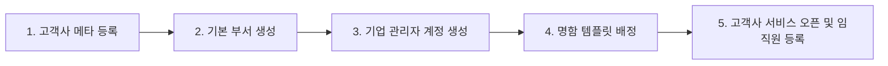

# NCMS 신규 고객사 온보딩 가이드 (Company Onboarding Manual)

| 항목 | 내용 |
|---|---|
| 문서명 | NCMS 신규 고객사 추가 및 운영 매뉴얼 |
| 버전 | v0.1 |
| 작성일 | 2026-07-24 |
| 대상 | 로그컴 시스템 관리자 및 운영팀 |

---

## 1. 개요 및 원칙

NCMS는 **동적 멀티테넌트(Dynamic Multi-Tenancy)** 아키텍처로 설계되어 있습니다.

- **Zero-Deployment (배포 작업 없음)**: 신규 고객사가 추가되더라도 소스 코드 수정이나 프론트엔드/백엔드 서버 재배포가 **일절 필요 없습니다.**
- **동적 브랜딩 (Dynamic Branding)**: DB에 등록된 고객사 코드(`site_code`), 로고 이미지, 대표 색상(`primary_color`)이 `https://logcom.co.kr/{고객사코드}` 진입 시 자동으로 반영됩니다.

---

## 2. 신규 고객사 추가 절차 (5-Step Checklist)

새로운 고객사(예: `(주)카카오`, 사이트 코드: `kakao`)가 계약을 완료하고 시스템에 추가될 때 진행하는 순서입니다.



---

### Step 1. 고객사 메타정보 등록

시스템 관리자 화면(`/admin/companies`)에 접속하거나, DB `companies` 테이블에 행(Row)을 추가합니다.

#### 필수 입력 항목
* **고객사 코드 (`site_code`)**: URL 경로 세그먼트로 사용될 영문 소문자/숫자 조합의 고유 식별자 (예: `kakao`, `samsung`, `hyundai`)
* **회사명 (`name`)**: 화면 상단 및 주문서에 표기될 공식 회사명 (예: `(주)카카오`)
* **로고 이미지 키/URL (`logo_file_key`)**: 상단 헤더에 노출될 고객사 로고 이미지 경로
* **대표 브랜드 색상 (`primary_color`)**: 화면 버튼, 강조 색상에 적용될 6자리 HEX 색상 코드 (예: `#FEE500`)
* **운영 정책**:
  * 명함 검수 정책 (`approval_policy`): `NOT_REQUIRED` (고객사 내부 승인 절차 없음, 로그컴 운영자가 명함 검수)
  * 배송지 정책 (`shipping_address_policy`): `FIXED` (기본 배송지 고정) / `USER_INPUT` (개인 입력) / `BOTH` (선택 가능)
  * 가격 노출 정책 (`price_visibility`): `VISIBLE` (금액 노출) / `HIDDEN` (금액 숨김)

#### DB SQL 실행 예시
```sql
INSERT INTO companies (
    id, site_code, name, logo_file_key, primary_color, 
    approval_policy, shipping_address_policy, price_visibility, status
) VALUES (
    gen_random_uuid(), 'kakao', '(주)카카오', 
    'https://cdn.logcom.co.kr/logos/kakao.png', '#FEE500', 
    'NOT_REQUIRED', 'BOTH', 'HIDDEN', 'ACTIVE'
);
```

---

### Step 2. 기본 부서 등록

해당 고객사의 기본 부서(예: `경영지원팀`, `플랫폼개발팀` 등)를 추가합니다.

* 시스템 관리자 화면(`/admin/companies/{companyId}/departments`) 또는 기업 관리자 화면에서 진행할 수 있습니다.

```sql
INSERT INTO departments (id, company_id, name, depth, sort_order) 
VALUES (
    gen_random_uuid(), 
    (SELECT id FROM companies WHERE site_code = 'kakao'), 
    '플랫폼개발팀', 1, 1
);
```

---

### Step 3. 기업 관리자(`COMPANY_ADMIN`) 계정 생성

고객사 사이트에서 임직원 계정 등록·수정·중지를 담당할 **기업 관리자 계정**을 최초 1개 이상 생성하여 고객사 담당자에게 전달합니다.

* **역할 코드**: `COMPANY_ADMIN`
* **소속 고객사**: Step 1에서 생성한 고객사 ID (`company_id`)
* **권한**: 소속 임직원 계정 등록/수정/중지, 부서 관리, 소속사 주문 조회 (승인 권한 없음)

---

### Step 4. AI 원본 기반 SVG 명함 템플릿 등록 및 좌표 매핑

신규 고객사의 AI(Adobe Illustrator) 원본 명함 시안을 파싱하여 **0.001pt 정밀 SVG 동적 미리보기 메타데이터**를 세팅하고 템플릿을 등록합니다.

#### 1) 로고 이미지 파일 등록
* 신규 업체의 국문/영문 로고 이미지를 `c:\NCMS\frontend\public\logos\` 경로에 저장합니다.
  - 예: `company_front_logo.png` (국문 앞면), `company_back_logo.png` (영문 뒷면)

#### 2) AI 원본 좌표 파싱 및 메타데이터 세팅
* [`c:\NCMS\frontend\src\shared\constants\cardTemplates.ts`](file:///c:/NCMS/frontend/src/shared/constants/cardTemplates.ts) 파일에 신규 업체 코드를 등록합니다.
* 명함 규격은 표준 **`90mm × 50mm` (aspect ratio 90:50 / 519 × 288.333)**를 사용하며, 로고 위치(`logoSpec`) 및 필드별 X, Y 좌표, 폰트크기(`fontSize`), 색상(`fill`)을 입력합니다.

```typescript
// cardTemplates.ts 등록 예시
newcompany: {
  front: {
    viewBox: "0 0 519 288.333", // 90mm x 50mm 정규격
    width: 519,
    height: 288.333,
    logoUrl: "/logos/newcompany_front_logo.png",
    logoSpec: { x: 25, y: 55, width: 165, height: 56 },
    showSlogan: false,
    showCenterLine: false,
    showBottomBar: false,
    fields: {
      name: { x: 285, y: 44, fontSize: 25, fontWeight: "700", fill: "#0f172a" },
      departmentPosition: { x: 285, y: 80, fontSize: 13, fontWeight: "500", fill: "#1e293b" },
      companyName: { x: 285, y: 138, fontSize: 14.5, fontWeight: "700", fill: "#0f172a" },
      telephone: { x: 285, y: 162, fontSize: 12.5, fontWeight: "500", fill: "#1e293b" },
      mobile: { x: 285, y: 183, fontSize: 12.5, fontWeight: "500", fill: "#1e293b" },
      email: { x: 285, y: 204, fontSize: 12.5, fontWeight: "500", fill: "#1e293b" },
      address1: { x: 285, y: 228, fontSize: 12, fontWeight: "400", fill: "#334155" },
    },
  },
  back: {
    viewBox: "0 0 519 288.333",
    width: 519,
    height: 288.333,
    logoUrl: "/logos/newcompany_back_logo.png",
    logoSpec: { x: 18, y: 74, width: 215, height: 52 },
    // 영문 뒷면 좌표 정의 ...
  },
}
```

#### 3) 고객사 템플릿 배정
* 로그컴 시스템 관리자 화면(`/admin/templates`)에서 해당 신규 고객사에 템플릿(`T_NEWCOMPANY`)을 배정(`company_templates`)합니다.
* 등록 즉시 해당 고객사 임직원 화면에서 **실시간 돋보기 줌/팬(Zoom & Pan) 미리보기**가 자동 지원됩니다.

---

### Step 5. 오픈 및 임직원 계정 등록 (서비스 시작)

1. **고객사 URL 접속**: `https://logcom.co.kr/kakao/login`
   - 접속 즉시 카카오 로고와 노란색(`#FEE500`) 브랜드 테마가 자동 주입됩니다.
2. **기업 관리자 로그인**: Step 3에서 발급받은 기업 관리자 계정으로 로그인합니다.
3. **임직원 계정 등록**: `/{companyCode}/company/members/new` 화면에서 임직원 계정을 직접 등록합니다.
4. **명함 발주 시작**: 등록된 임직원이 접속하여 명함 정보 입력 → 교정 확인 → 주문 접수가 진행됩니다.

---

## 3. 예외 상황 및 문제 해결 (Troubleshooting)

| 현상 | 원인 | 조치 방법 |
|---|---|---|
| 접속 시 `404 고객사 사이트를 찾을 수 없습니다` 오류 발생 | 1. URL의 `site_code` 오타<br>2. DB `companies.status`가 `INACTIVE` 상태 | 1. URL의 고객사 코드 철자 확인<br>2. DB에서 `status = 'ACTIVE'`로 업데이트 |
| 브랜드 대표 색상이 반영되지 않고 기본 파란색으로 표시됨 | `primary_color` 값이 누락되었거나 유효하지 않은 HEX 코드 형태임 | `primary_color` 값을 `#FEE500`과 같이 `#` 포함 6자리 HEX 코드로 수정 |
| 임직원 로그인 후 다른 회사 메뉴가 노출되거나 권한 오류 발생 | 사용자 계정의 `company_id` 또는 `role`이 잘못 할당됨 | `members` 및 `member_roles` 테이블의 소속 고객사 ID 및 역할 코드 확인 |
