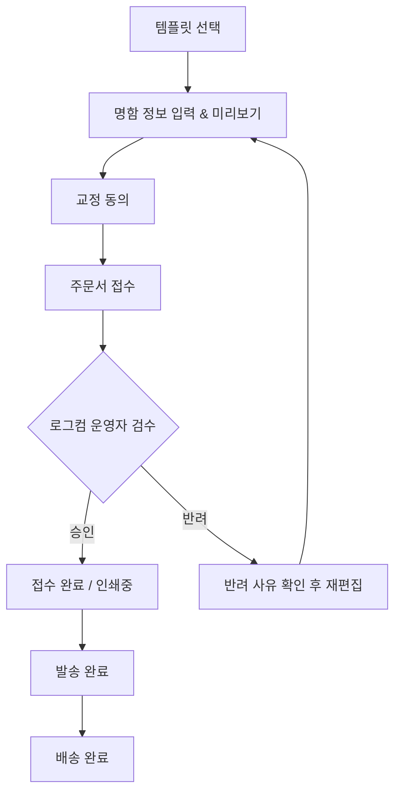

# NCMS 기능정의서 (MVP 간소화 버전)

| 항목 | 내용 |
|---|---|
| 문서명 | NCMS (NameCard Management System) 기능정의서 |
| 버전 | v0.5 (로그컴 어드민 동선/성능/검색필터 완결) |
| 작성일 | 2026-07-30 |
| 개발 스택 | Spring Boot / React / PostgreSQL |
| 배포 구성 | Backend: Railway / Frontend: Vercel |
| 저장소 구성 | 단일 Git 저장소의 `backend`, `frontend` 분리형 모노레포 |
| 문서 상태 | MVP 명함 주문, 상태관리, 동선/성능/검색필터 최적화 완료 |

---

## 1. 문서 목적

본 문서는 기업 임직원의 명함 주문부터 로그컴 운영자의 오타/오류 검수, 인쇄·발송까지 이어지는 B2B 핵심 업무를 신규 시스템으로 신속하고 효율적으로 구현하기 위한 기능 기준을 정의한다.

1차 개발에서는 복잡한 인프라/감사/비동기 로직을 최소화하고, **실용적인 핵심 명함 발주 및 검수/제작 프로세스** 구현에 집중한다.

---

## 2. 핵심 설계 원칙

### 2.1 경로 기반 동적 멀티테넌트
- **고객사 경로**: `https://logcom.co.kr/{companyCode}` (예: `/samsung`, `/kakao`).
- **동적 브랜딩**: 접속 경로에 따라 고객사 로고 및 대표 색상이 동적으로 주입된다.
- **데이터 격리**: 데이터 조회의 기준은 로그인 세션/토큰의 `company_id`를 기반으로 백엔드에서 강제 분기한다.

### 2.2 주문 스냅샷
- 주문 완료 시점의 명함 문구 데이터, 템플릿, 수량/옵션 정보를 `order_snapshots`에 고정 저장한다.
- 주문 이후 기준정보가 바뀌어도 과거 주문 데이터는 변하지 않는다.

### 2.3 단순화된 권한 및 역할 체계 (3대 역할 RBAC)
- `ROLE_OPERATOR` (로그컴 어드민): 전 고객사 주문/계정/템플릿 검수, 인쇄/배송 관리 및 시스템 전체를 관리하는 마스터 관리자 (독립 어드민 URL `/login`, `/operator` 접근)
- `ROLE_COMPANY_ADMIN` (기업 관리자): 소속 임직원 계정 등록·수정·중지, 부서 관리, 소속사 주문 목록 조회 (고객사 전용 경로 `/:companyCode`)
- `ROLE_EMPLOYEE` (일반 임직원): 템플릿 선택, 명함 입력/미리보기, 교정 동의, 주문 접수, 본인 주문 조회 (고객사 전용 경로 `/:companyCode`)

---

## 3. 핵심 업무 흐름 & 상태 모델

### 3.1 업무 프로세스

### 3.2 단일화된 주문 상태 (Order Status)

상태 트랜잭션 관리를 단순화하기 위해 **단일 주문 상태 코드**를 사용한다.

| 상태 코드 | 명칭 | 설명 |
|---|---|---|
| `PENDING` | 검수 대기 | 주문 접수 후 로그컴 운영자의 명함 검수(오타 확인 등) 대기 |
| `APPROVED` | 검수 승인 | 운영자 검수 완료 (인쇄 대기 상태) |
| `REJECTED` | 반려 | 운영자가 오타·오류 사유 기록 후 반려 |
| `PRINTING` | 인쇄중 | 인쇄 제작 진행 중 |
| `SHIPPED` | 발송 완료 | 택배사 및 송장번호 입력 후 발송 |
| `DELIVERED` | 배송 완료 | 배송 완료 처리 |
| `CANCELLED` | 취소 | 허용 단계에서의 주문 취소 |

---

## 4. 핵심 기능 목록 (MVP 범위)

### 4.1 인증 및 계정 (Auth)
- **AUTH-001 로그인/로그아웃**: 아이디/비밀번호 기반 JWT 인증 처리.
- **AUTH-002 비밀번호 변경/초기화**: 본인 비밀번호 변경 및 관리자 임시 비밀번호 발급.

### 4.2 고객사 & 부서 관리 (Company & Department)
- **COM-001 고객사 등록/수정**: 회사명, 사이트 코드(`siteCode`), 로고 이미지 URL, 대표 브랜드 색상(`primaryColor`) 설정.
- **DEPT-001 부서 관리**: 고객사별 부서 목록 등록 및 계층/순서 관리.

### 4.3 회원 관리 (Member)
- **MEM-001 기업 임직원 등록**: 기업 관리자(`COMPANY_ADMIN`)가 소속 임직원 계정을 직접 등록.
- **MEM-002 회원 목록/수정/중지 및 권한 격리**: 소속 임직원 목록 조회(리스트 그리드 이메일 표기 포함), 기본 정보(비밀번호 및 이메일) 수정, 퇴사/비활성화 처리 (`ROLE_EMPLOYEE` 권한 사용자는 좌측 사이드바 및 모바일 메뉴에서 '회원 관리' 노출 제외, URL 직접 접근 시 `RequireMemberManageAuth` 라우트 가드 및 백엔드 403 Forbidden 차단 처리).

### 4.4 템플릿 & 상품 관리 (Template & Product)
- **TPL-001 템플릿 등록 및 배정**: 명함 템플릿 기본 정보(앞/뒷면 이미지, 입력 필드 구성) 등록 및 특정 고객사에 배정.
- **PRD-001 명함 재질/수량 옵션**: 재질(예: 스노우지, 띤또레또 등) 및 선택 가능 수량 옵션 관리.

### 4.5 명함 편집 & 교정확인 & 주문 (Order) - [완료]
- **ORD-001 명함 입력 및 정밀 SVG 동적 미리보기**: 템플릿 기반 명함 폼 입력 및 0.001pt 정밀 SVG 동적 미리보기 팝업 모달 연동 (제일엔지니어링 명함 폰트 패밀리, 굵기, 글자 크기, 자간 사양을 인쇄용 PDF 엔진과 1:1 완벽 동기화).
- **ORD-002 교정 확인 및 재편집**: 교정확인 모달 내 상단 실시간 명함 렌더링(앞/뒷면) 노출, 오탈자 동의 및 `[수정하기]` 클릭 시 입력 데이터 유지 보존 재편집 기능.
- **ORD-003 배송지 입력 및 주문 제출**: `[본사입고]` 원클릭 버튼, Daum 우편번호 API 연동 및 배송/주문 메모 작성 백엔드 스냅샷 연동 (`PENDING` 상태 시작).
- **ORD-004 인쇄용 pure Vector (CMYK K80) PDF 엔진**: `html2canvas` 픽셀 이미지화 캡처 방식을 완전 제거하고, 로고·상호·슬로건 이미지를 제외한 **성명, 부서/직급, 직급2, 연락처, 이메일, 주소 등 모든 문구 텍스트가 100% 보존되어 Adobe Illustrator에서 마우스 드래그 및 텍스트 툴로 직접 수치가 가능한 Native Vector Text 92mm x 52mm 인쇄용 PDF** 생성 엔진 연동 (제일엔지니어링 명함 성명/직급 영역 원복 유지, 하단 주소·연락처 영역 자간 앞면 `-0.17mm`/뒷면 `-0.08mm`, 주소 36자 이상 장문 시 자간 추가 축소 앞면 `-0.28mm`/뒷면 `-0.15mm`, 행간 앞면 `1.39`/뒷면 `1.27` 상호 포함 균일 밀착 연동 및 PDF 엔진 전용 상호 수직 위치 앞면 `-6pt`/뒷면 `-2pt` 오프셋 보정).

### 4.6 명함 검수 & 상태 변경 (Approval & Operator) - [완료]
- **APR-001 로그컴 운영자 검수**: `PENDING` 주문 목록 조회 및 명함 미리보기 확인.
- **APR-002 검수 승인/반려 및 자동 메일 발송**: 업체관리부/운영자 검수 승인(`APPROVED`) 시 수신처(`logcom2@naver.com`, `chohw37@naver.com`)로 주문 승인 알림 메일 자동 발송 연동. 제일엔지니어링(`cheil`) 소속 `cheil_emp`(또는 소속 임직원)가 신규 명함 주문을 접수할 경우, `cheil_admin` 기업 관리자의 이메일 주소 및 추가 수신자(`chohw37@naver.com`)로 주문 완결/접수 안내 메일을 즉시 자동 발송 연동. 반려(`REJECTED`) 처리 시 반려 사유 필수 기재.
- **APR-003 템플릿 사양 고도화**:
  - **제일엔지니어링**: 상호 폰트 `HY울릉도M`, 슬로건 `"Smiling Technology"` 이미지 자산(`cheil_smile.jpg`, Y: 242로 5pt 하향 조절), 필드 입력 유무(이메일/직통전화/주소 등 누락 시)에 따른 하단 기준 동적 정렬 연산(Bottom-Up Stacking; 웹사이트 Y:255 기준 역순 밀착 배치로 중간 빈 공간 완전 제거), 영문 직급(`position1`) 표기 시 영문 부서(`department`) 미입력 시 직급 뒤 슬래시(`/`) 자동 제거 처리 및 하단 바 적정 여백 조절, 2번째 명함 템플릿(앞면 회사명 이미지 자산 `cheil_front_name.jpg` 적용 및 `cheil_build_front_name.jpg`와 상호 선택 가능) 지원 추가 완료, 부서 선택 드롭다운 53개 항목(한글/영문 매핑) 최신 조직 개편 사양 동기화 갱신 완료, 제일엔지니어링 전체 템플릿 입력 폼 라벨 '직급' ➔ '직책' 명칭 변경 완료, 영문 직책 입력 폼 내 불필요한 미꼬리 슬래시(`/`) 자동 삽입 제거 완료, 영문 뒷면 배치 순서 1행 `부서 / 직책` (`Department / Position`) 및 2행 `자격` (`Qualification / Position2`) 개편 완료, 3번째 명함 템플릿(`제일엔지니어링 본사 현장사무실 주소겸용`, ID: 5, 단면 전용, 부서 수기입력, 독립된 `직책` 및 `직급` 수기입력, 자격사항 항목 제거, 명함 상단 1행 `부서`(슬래시 없음) / 2행 `직책 / 직급` 분할 표기, `cheil_build_front_name.jpg` 상호 적용, `본사 : ` 및 `현장 : ` 주소 자동 접두사 부여(현장주소 미입력 시에도 `현장 : ` 고정 렌더링), 대표전화 대신 `전화 : ` 문구 적용, 직통번호 제외, 제일엔지니어링 전체 템플릿 우측 상단 인적 텍스트 블록 폰트 크기 확대 적용, 일반적인 길이의 주소(약 38자 이내)는 1줄로 원형 유지하고 초장문 주소(38자 초과) 및 수동 엔터 입력 시에만 스마트 줄바꿈 적용 및 2줄 이상 분할 시 상단 항목 수직 위치 자동 상향 동적 정렬(Bottom-Up Stacking) 100% 웹 미리보기/PDF 동기화 적용, 입력 폼 현장주소 textarea 전환 적용, 전체 부서/직책 문구 장문 입력 시 자동 동적 자간 축소(-0.03em~-0.14em) 100% 웹/PDF 적용 완료, 주문서 이동 시 템플릿 ID 5번(`본사 현장사무실 주소겸용`)에 한해 '본사입고 (주소 생략)'을 제외하고 '공사현장/수기입력' 모드 기본 활성화, 제일엔지니어링 전체 명함 사양(재질) 선택지에서 '아르미230' 완전 제외 및 '휘라레 216g' 전용 선택 제공 완료, 직책 및 직급 텍스트 결합 시 30자 초과 시 직급 2행 자동 분할 렌더링 및 PDF 다운로드 시 웹 SVG 미리보기와 1:1 완벽 좌표/항목 동기화 보정 완료.
  - **한미글로벌**: 고객 일러스트레이터 피드백 규격 반영(`나눔스퀘어OTF_ac` 폰트 매핑, 성명 ExtraBold 13pt + Tracking 100 / `letter-spacing: 0.1em`, 부서/직급 Bold 6pt, 연락처/주소 Bold 7pt, 상호명 `한미글로벌 주식회사`/`HanmiGlobal Co.,Ltd.` 원본 아웃라인 자산 이미지 `hanmi_front_name.jpg`/`hanmi_back_name.jpg` 렌더링 적용), 필드 입력 유무(이메일/핸드폰/웹사이트 등 누락 시)에 따른 주소 최하단 기준 동적 정렬 연산(Bottom-Up Stacking; 앞면 주소 Y:236 / 뒷면 주소 Y:242 기준 역순 밀착 배치로 중간 빈 공간 완전 제거), 영문 주소 Y좌표 정밀 하향 조정, 연락처 `+82 (0)70-XXXX-XXXX` / `+82 (0)10-XXXX-XXXX` 국가번호 자동 주입 포맷팅, 앞면 주소 엔터(\n) 입력 시 2줄 자동 줄바꿈 분할 렌더링, 앞면 및 뒷면 우측 컨텐츠 블록 X위치 동기화(`x: 268`), 앞면(국문) 로고 Y위치 2pt 상향 조절(`y: 67`), 뒷면(영문) 로고 우측 이동(`x: 28`), 국문/영문 부서·직급 '직접입력' 활성화, 한미 전용 입력 폼 제어(앞/뒷면 팩스 및 직통번호 완벽 제거, 앞면 웹사이트 제거, 뒷면 영문 웹사이트 `www.hanmiglobal.com` 복구 및 영문 주소 1~3행 분할 입력 제공), 용지 선택 옵션에서 '휘라레 216g' 옵션 제외 처리, 기본 주소(2줄) 및 기본 연락처/이메일(`00000000@hanmiglobal.com`) 갱신, 기본 재질('아르미230') 및 수량('300매') 지정, 템플릿 관리 카드 카테고리 문구 `한미글로벌 표준템플릿` 표시 반영, 전체 부서/직책 문구 장문 입력 시 자동 동적 자간 축소(-0.03em~-0.14em) 100% 웹/PDF 적용 완료.
  - `승인대기`: 주문승인 (`APPROVED`), 주문취소 (`CANCELLED`), 주문반려 (`REJECTED`)
  - `승인완료`: 인쇄 시작 (`PRINTING`), 주문취소 (`CANCELLED`)
  - `인쇄중`: 발송 처리 (`SHIPPED`)
  - `발송완료`: (하단 액션 없음)
  - `승인반려`: 재승인 요청 (`PENDING`), 주문취소 (`CANCELLED`)
  - `주문취소`: 영구 삭제 (`DELETE`)
  - **컨펌 모달**: 선택 주문번호 및 **주문자 이름(예: 홍길동)** 명시, 긍정 파랑 테마(`bg-blue-600`) / 부정 빨강 테마(`bg-red-600`) 버튼 제공 및 상태 변경 후 해당 탭으로 자동 전환.
- **APR-004 고객사용 전 상태 재주문 & 템플릿 편집 모달 연동**: 주문 목록 내 고객사 주문 상태(승인대기/승인완료/인쇄중/발송완료/승인반려/주문취소 등)에서 `[재주문]` 버튼을 제공하며, 클릭 시 `TemplateEditModal` 모달이 팝업되어 기존 주문 명함 데이터가 그대로 pre-fill된 상태에서 실시간 렌더링 확인 및 동일 내용으로 즉시 재주문 접수 가능 (`ROLE_OPERATOR` 운영자 계정 화면에서는 '재주문' 버튼 노출 제외).
- **APR-005 원클릭 배송 추적(Shipment Tracking) 자동 연동**:
  - **상태 컬럼 `[발송완료]` 배지 버튼화**: 주문 상태가 `발송완료`(`SHIPPED`)이고 송장번호가 등록되어 있는 경우, 고객사 임직원 및 로그컴 운영자 공통으로 **`[발송완료]` 배지 자체가 클릭 가능한 버튼으로 동작**하며, 클릭 시 해당 택배사 공식 실시간 배송조회 페이지로 새 창 이동.
  - **작업 컬럼 `[송장 입력/수정 트럭 아이콘]` 버튼**: 로그컴 운영자 계정(`isOperator` / `ROLE_OPERATOR`)에서만 작업 컬럼 우측에 트럭 모양 아이콘 버튼(`ShipmentTrackingModal` 팝업)을 노출하여 송장번호 등록/수정 관리 기능 제공. (고객사 임직원/유저 화면에서는 트럭 아이콘 비노출)

### 4.7 제작 & 배송 관리 (Production & Shipment) - [완료]
- **PRD-002 인쇄소 제출용 100% 무손실 벡터 PDF 즉시 다운로드**: 로그컴 운영자 계정(`ROLE_OPERATOR` / `/operator` 동선) 전용으로 주문 목록 및 주문 상세에서 `[명함 인쇄 / PDF]` 버튼 클릭 시, 인쇄 마진(도련)이 포함된 92mm × 52mm (실재 재단 90mm × 50mm) 2페이지(앞면 국문/뒷면 영문) PDF (`[YYYY-MM-DD]-[주문번호].pdf`) 즉시 자동 다운로드 (일반 유저/기업관리자 화면에서는 PDF 다운로드 버튼 제거).
- **PRD-003 Native CMYK & opentype.js 100% Vector Outline PDF 엔진**: `HY울릉도M` (`HYWULM.TTF`), `a파도소리` (`a파도소리_3.otf`) 원본 폰트를 `opentype.js`로 읽어 텍스트를 인쇄용 pure vector path(`path d="M..."`)로 1:1 곡선화(Outline) 변환하고, PDF 내 Native CMYK (`DeviceCMYK`, K80 `0 0 0 0.8 k`) 인코딩 지정 지원.
- **SHP-001 인쇄중/발송 처리 및 인쇄 출력**: 운영자가 주문 상태를 `PRINTING`으로 변경하고 인쇄용 PDF/명함 즉시 인쇄 확인.
- **SHP-002 송장 입력 & 발송 완료**: 택배사 및 송장번호를 등록하여 `SHIPPED` 상태로 변경.
- **SHP-004 택배사 송장 엑셀(.xlsx/.xls/.csv) 업로드 스마트 매칭**: 운영자 주문 화면 상단 `[송장 엑셀 업로드]` 버튼 클릭 시, 엑셀 파일 내 다양한 컬럼 헤더(`받는분`/`수령인`/`이름` 및 `운송장번호`/`송장번호`)를 유연하게 자동 감지하고, `고객주문번호` 유무와 관계없이 **`운송장번호` + `받는분(수령인/주문자)`** 정보를 기반으로 시스템 DB의 진행 중인 주문을 자동 탐색·매칭하여 송장번호 등록 및 `발송완료(SHIPPED)` 상태로 일괄 자동 전환.
- **SHP-003 주문 영구 삭제**: 취소된 주문 내역 영구 삭제 처리 (`DELETE`).
- **QRY-001 주문 목록 & 상세 조회**: 역할별(임직원/기업관리자/운영자/시스템관리자) 권한에 맞는 주문 내역 및 배송 상태 조회 (주문 목록 '이름' 컬럼 및 상세 모달 이름에 배송지 수령인 이름(`recipientName`) 표시, 상세 모달 이메일 항목에 주문자 회원 이메일(`memberEmail`) 연동, '승인반려' 태그 마우스 오버 시 반려 사유 툴팁 노출, 상세 모달 접수일자를 `YYYY-MM-DD (요일) HH:mm` 포맷으로 표시, 작업 컬럼 내 주문 메모(`memo`) 아이콘 클릭 시 상세 모달 오픈 동작 제거 및 마우스 오버 말풍선 툴팁 전용 노출, 작업 컬럼 내 '명함 미리보기' Eye 버튼 클릭 시 주문 상세 모달 오픈 동작 제거 및 마우스 오버 툴팁 미리보기 전용 노출, 일반 임직원(`ROLE_EMPLOYEE`)을 포함한 전체 계정에 작업 컬럼 내 '배송 추적' 아이콘 노출).
- **EXC-001 주문 목록 엑셀 다운로드**: 주문 관리 화면 상단 `[엑셀 다운로드]` 버튼 클릭 시, 신규 9컬럼 양식 및 폰트/셀 스타일(`260731.xlsx` 기반: 헤더 굴림 9pt bold 배경 `#F0F0F0` 테두리 `1px solid #000`, 데이터행 맑은고딕 11pt, 컬럼 너비 A:180px, B:130px, C:450px 등)에 맞춰 데이터를 매핑한 `.xls` 파일 (`[siteCode]_order_list_[YYYY-MM-DD].xls`) 즉시 다운로드.

### 4.8 고객사 맞춤형 메뉴 & 이용가이드 & 실데이터 매핑 (Tenant Guide & Data) - [완료]
- **GUI-001 테넌트(cheil/hanmi) 전용 이용가이드 및 커스텀 브랜드 로고/타이틀**: `siteCode`가 `cheil` 또는 `hanmi`인 경우 및 로그컴 관리자(`logcom`) 접속 시 로그인 화면([LoginPage.tsx](file:///c:/NCMS/frontend/src/pages/auth/LoginPage.tsx))과 메인 사이드바([Sidebar.tsx](file:///c:/NCMS/frontend/src/components/layout/Sidebar.tsx)) 상단에 브랜드 로고 자산(`cheil_logo.png`, `hanmi_logo.png`, `logcom_logo.jpg`)을 렌더링하도록 일체화. 로그인 하단 문의 영역 정보(이메일: `logcom2@naver.com`, 전화: `02-552-7942`) 업데이트 완료. 또한 사이드바 `이용가이드` 메뉴 및 가이드 모달(`UserGuideModal`) 연동 완료.
- **DAT-001 테넌트별 레이아웃 정밀 조정 및 미리보기-PDF 100% 동기화**: `/public/hanmi/` 및 `/public/cheil/` 하위 자산 구조 정형화. 제일엔지니어링 앞면 상호(y: 124) 및 뒷면 상호(y: 121), 슬로건 위치(x: 35, y: 236) 등 모든 수직/수평 좌표 체계를 공통 명함 스펙(`CARD_TEMPLATE_SPECS`)과 `cheilY` 연산 객체로 통합 관리하여 웹 미리보기(`SvgBusinessCardPreview.tsx`)와 고해상도 인쇄용 PDF 다운로드 엔진(`generateCardPrintPdf.ts`)에 100% 동일하게 일치 적용 완료.
- **DAT-002 향후 DB 부서/직급 마스터 연동 대비 표준화**: 명함 데이터(`card_data` JSONB)는 기존 자유 입력을 100% 보존하면서, 표준 인터페이스(`StandardCardFieldData`: `departmentName`, `departmentId`, `positionName`, `positionId`) 적용 및 DB `departments` 마스터 시드 데이터([V7__add_standard_department_seeds.sql](file:///c:/NCMS/backend/src/main/resources/db/migration/V7__add_standard_department_seeds.sql))를 최신 `companyData` 데이터셋과 100% 동기화 보강 완료.

---

## 5. 고객사별 명함 PDF 레이아웃 및 폰트 디자인 명세

### 5.1 공통 인쇄 PDF 규격
- **캔버스 스케일**: 519 × 288.333 SVG coordinate scale ➔ **jsPDF 92mm × 52mm (가로 92mm, 세로 52mm landscape)**
- **좌표 축척 변환율**: `sx = 92 / 519`, `sy = 52 / 288.333`
- **TrueType ASCII VFS 폰트 레지스트리**:
  - `NanumSquareEB` ➔ `/fonts/NanumSquareEB.ttf`
  - `NanumSquareB` ➔ `/fonts/NanumSquareB_1.ttf`
  - `NanumSquareR` ➔ `/fonts/NanumSquareR.ttf`
  - `AppleSDGothicNeoL00` / `AppleSDGothicNeo` ➔ `/fonts/NanumSquareR.ttf`
  - `AppleSDGothicNeoB00` / `AppleSDGothicNeoB` ➔ `/fonts/NanumSquareB_1.ttf`

---

### 5.2 한미글로벌 (HanmiGlobal) PDF 사양
- **로고 Y좌표**: 앞면 `y = 67`, 뒷면 `y = 71` (우측 이동 X: `28`)
- **앞면 (국문)**:
  - **성명 (Name)**: `NanumSquareEB` 13pt (`y = 44`, baseline `44 + 13 * 0.76`)
  - **부서/직급**: `NanumSquareB` 6pt
  - **상호명 이미지 Asset**: `y = 148`, 가로 `143.7`, 세로 `14.2`
  - **하단 연락처 & 주소 항목**: `NanumSquareB` 7pt
    - 라벨/값 2pt 이격 간격 적용 (값 시작 X: `288`)
    - T (대표전화): `y = 172`
    - M (핸드폰): `y = 193`
    - E (이메일): `y = 214`
    - Addr1 (주소 1행): `y = 238`
    - Addr2 (주소 2행): `y = 258`
- **뒷면 (영문)**:
  - **상호명 이미지 Asset**: `y = 164`, 가로 `159.9`, 세로 `14.2`
  - **웹사이트 (`www.hanmiglobal.com`)**: `y = 188` (독립 위치)
  - **영문 주소 (3줄)**: `y = 209`, `227`, `245`
  - **직책 2 (`position2`)**: `y = 110` (`x = 268`)

---

### 5.3 제일엔지니어링 (Cheil Engineering) PDF 사양
- **로고 Y좌표**: 앞면 및 뒷면 로고 1mm 하향 조정 반영 (`logoSpec.y * sy + 1.0mm`)
- **성명 (Name)**: `NanumSquareEB` 11pt
  - Y좌표: 앞면 및 뒷면 2mm 하향 조정 반영 (`+ 2.0mm`)
- **부서 / 직급 / 직책 (Department & Position)**: `NanumSquareB` 6pt
  - Y좌표: 앞면 및 뒷면 부서/직급/직책2 모두 2mm 하향 조정 반영 (`+ 2.0mm`)
  - **장문 자동 자간 축소**: 영문 부서/직급 텍스트 길이가 **45자 이상**일 경우 우측 잘림 방지를 위해 자동으로 **자간 10 축소 (`{ charSpace: -0.12 }`)** 렌더링 적용
- **상호명 이미지 Asset (Company Name Image)**:
  - **앞면 `templateId === 4` (`cheil_front_name.jpg`)**: `y = 124`, `height = 16`, `width = 122` (가로 늘어짐 방지 축소 보정)
  - **앞면 기타 템플릿 (`cheil_build_front_name.jpg`)**: `y = 124`, `height = 16`, `width = 252`
  - **뒷면 전체 템플릿 (`cheil_back_name.jpg`)**: `y = 121`, `height = 9.5`, `width = 234` (전체 뒷면 9.5pt 축소)
- **슬로건 이미지 Asset ("Smiling Technology")**:
  - `y = 236`, `height = 15.5`, `width = 135` (세로 비율 축소)
- **주소 및 연락처 블록 (Address & Contacts)**:
  - **폰트**: `AppleSDGothicNeoL00` 7pt (일반 텍스트), `AppleSDGothicNeoB00` 7pt (웹사이트)
  - **자간**: **`-30` em** (`{ charSpace: -0.24 }`)
  - **앞면 국문 레이아웃**:
    - 주소 Line 1: `151`
    - 대표전화/팩스 (`telAndFax`): `170`
    - 직통전화 (`directTel`): `189`
    - 핸드폰 (`mobile`): `208`
    - 이메일 (`email`): `227`
    - 웹사이트 (`website`): `246`
  - **뒷면 영문 레이아웃 (개별 완전 독립 분리 & 줄간격 +2 확장)**:
    - 상호명: `121`
    - 주소 Line 1 (`address1`): `141` (`22-6, Gangnamdaero 16gil, Seocho-gu,`)
    - 주소 Line 2 (`address2`): `156` (`Seoul, Korea (06779)`) - *전화번호 라인과 겹침 100% 방지*
    - 대표전화 (`telAndFax`): `174` (+18pt 확장)
    - 직통전화 (`directTel`): `192` (+18pt 확장)
    - 핸드폰 (`mobile`): `210` (+18pt 확장)
    - 이메일 (`email`): `228` (+18pt 확장)
    - 웹사이트 (`website`): `246` (+18pt 확장)

---

## 6. 2차 개발 이전 및 간소화 사항 (MVP 제외)
- 복잡한 캔버스 좌표/폰트 정밀 validation 엔진 (`EDT-006` 정밀 처리 등)
- DB 비동기 메일 발송 큐 및 재시도 워커 (`notifications` 세부 스케줄링)
- 31개 세부 이력/감사 로그 테이블 및 SHA-256 파일 체크섬 일치 검사
- 결제 시스템(토스페이먼츠) 및 월별 정산 시스템

