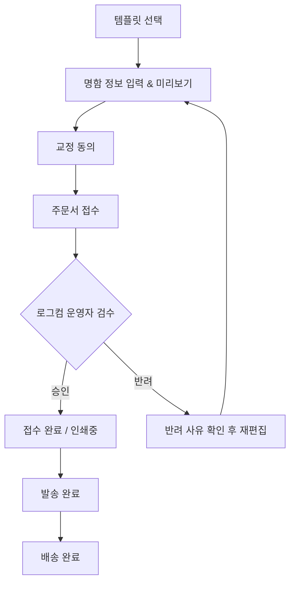

# NCMS 기능정의서 (MVP 간소화 버전)

| 항목 | 내용 |
|---|---|
| 문서명 | NCMS (NameCard Management System) 기능정의서 |
| 버전 | v0.5 (로그컴 어드민 동선/성능/검색필터 완결) |
| 작성일 | 2026-07-30 |
| 개발 스택 | Spring Boot / React / PostgreSQL |
| 배포 구성 | Backend: Railway / Frontend: Vercel |
| 저장소 구성 | 단일 Git 저장소의 `backend`, `frontend` 분리형 모노레포 |
| 문서 상태 | MVP 명함 주문, 상태관리, 동선/성능/검색필터 최적화 완료 |

---

## 1. 문서 목적

본 문서는 기업 임직원의 명함 주문부터 로그컴 운영자의 오타/오류 검수, 인쇄·발송까지 이어지는 B2B 핵심 업무를 신규 시스템으로 신속하고 효율적으로 구현하기 위한 기능 기준을 정의한다.

1차 개발에서는 복잡한 인프라/감사/비동기 로직을 최소화하고, **실용적인 핵심 명함 발주 및 검수/제작 프로세스** 구현에 집중한다.

---

## 2. 핵심 설계 원칙

### 2.1 경로 기반 동적 멀티테넌트
- **고객사 경로**: `https://logcom.co.kr/{companyCode}` (예: `/samsung`, `/kakao`).
- **동적 브랜딩**: 접속 경로에 따라 고객사 로고 및 대표 색상이 동적으로 주입된다.
- **데이터 격리**: 데이터 조회의 기준은 로그인 세션/토큰의 `company_id`를 기반으로 백엔드에서 강제 분기한다.

### 2.2 주문 스냅샷
- 주문 완료 시점의 명함 문구 데이터, 템플릿, 수량/옵션 정보를 `order_snapshots`에 고정 저장한다.
- 주문 이후 기준정보가 바뀌어도 과거 주문 데이터는 변하지 않는다.

### 2.3 단순화된 권한 및 역할 체계 (3대 역할 RBAC)
- `ROLE_OPERATOR` (로그컴 어드민): 전 고객사 주문/계정/템플릿 검수, 인쇄/배송 관리 및 시스템 전체를 관리하는 마스터 관리자 (독립 어드민 URL `/login`, `/operator` 접근)
- `ROLE_COMPANY_ADMIN` (기업 관리자): 소속 임직원 계정 등록·수정·중지, 부서 관리, 소속사 주문 목록 조회 (고객사 전용 경로 `/:companyCode`)
- `ROLE_EMPLOYEE` (일반 임직원): 템플릿 선택, 명함 입력/미리보기, 교정 동의, 주문 접수, 본인 주문 조회 (고객사 전용 경로 `/:companyCode`)

---

## 3. 핵심 업무 흐름 & 상태 모델

### 3.1 업무 프로세스

### 3.2 단일화된 주문 상태 (Order Status)

상태 트랜잭션 관리를 단순화하기 위해 **단일 주문 상태 코드**를 사용한다.

| 상태 코드 | 명칭 | 설명 |
|---|---|---|
| `PENDING` | 검수 대기 | 주문 접수 후 로그컴 운영자의 명함 검수(오타 확인 등) 대기 |
| `APPROVED` | 검수 승인 | 운영자 검수 완료 (인쇄 대기 상태) |
| `REJECTED` | 반려 | 운영자가 오타·오류 사유 기록 후 반려 |
| `PRINTING` | 인쇄중 | 인쇄 제작 진행 중 |
| `SHIPPED` | 발송 완료 | 택배사 및 송장번호 입력 후 발송 |
| `DELIVERED` | 배송 완료 | 배송 완료 처리 |
| `CANCELLED` | 취소 | 허용 단계에서의 주문 취소 |

---

## 4. 핵심 기능 목록 (MVP 범위)

### 4.1 인증 및 계정 (Auth)
- **AUTH-001 로그인/로그아웃**: 아이디/비밀번호 기반 JWT 인증 처리.
- **AUTH-002 비밀번호 변경/초기화**: 본인 비밀번호 변경 및 관리자 임시 비밀번호 발급.

### 4.2 고객사 & 부서 관리 (Company & Department)
- **COM-001 고객사 등록/수정**: 회사명, 사이트 코드(`siteCode`), 로고 이미지 URL, 대표 브랜드 색상(`primaryColor`) 설정.
- **DEPT-001 부서 관리**: 고객사별 부서 목록 등록 및 계층/순서 관리.

### 4.3 회원 관리 (Member)
- **MEM-001 기업 임직원 등록**: 기업 관리자(`COMPANY_ADMIN`)가 소속 임직원 계정을 직접 등록.
- **MEM-002 회원 목록/수정/중지**: 소속 임직원 목록 조회, 기본 정보 수정, 퇴사/비활성화 처리.

### 4.4 템플릿 & 상품 관리 (Template & Product)
- **TPL-001 템플릿 등록 및 배정**: 명함 템플릿 기본 정보(앞/뒷면 이미지, 입력 필드 구성) 등록 및 특정 고객사에 배정.
- **PRD-001 명함 재질/수량 옵션**: 재질(예: 스노우지, 띤또레또 등) 및 선택 가능 수량 옵션 관리.

### 4.5 명함 편집 & 교정확인 & 주문 (Order) - [완료]
- **ORD-001 명함 입력 및 정밀 SVG 동적 미리보기**: 템플릿 기반 명함 폼(이름 '홍길동' 통일, 부서/직급 매핑, 국문 번호 `+82` 제거, 영문 번호 `+82-10-XXXX-XXXX` 자동포맷팅) 입력 및 AI 원본 좌표 파싱 기반 0.001pt 정밀 SVG 동적 미리보기 팝업 모달 연동.
- **ORD-002 교정 확인 및 재편집**: 교정확인 모달 내 상단 실시간 명함 렌더링(앞/뒷면) 노출, 오탈자 동의 및 `[수정하기]` 클릭 시 입력 데이터 유지 보존 재편집 기능.
- **ORD-003 배송지 입력 및 주문 제출**: `[본사입고]` 원클릭 버튼(주소 자동 세팅), 신주소/구주소 자동완성 검색, 공사현장용 `수기 직접 입력` 지원 및 작성 메모 백엔드 스냅샷 연동 (`PENDING` 상태 시작).

### 4.6 명함 검수 & 상태 변경 (Approval & Operator) - [완료]
- **APR-001 로그컴 운영자 검수**: `PENDING` 주문 목록 조회 및 명함 미리보기 확인.
- **APR-002 검수 승인/반려**: 검수 승인(`APPROVED`) 또는 반려(`REJECTED`, 반려 사유 필수 기재) 처리.
- **APR-003 탭별 하단 액션 & 주문 상태 변경 모달**:
  - `승인대기`: 주문승인 (`APPROVED`), 주문취소 (`CANCELLED`), 주문반려 (`REJECTED`)
  - `승인완료`: 인쇄 시작 (`PRINTING`), 주문취소 (`CANCELLED`)
  - `인쇄중`: 발송 처리 (`SHIPPED`)
  - `발송완료`: (하단 액션 없음)
  - `승인반려`: 재승인 요청 (`PENDING`), 주문취소 (`CANCELLED`)
  - `주문취소`: 영구 삭제 (`DELETE`)
  - **컨펌 모달**: 선택 주문번호 명시, `취소하기` / `"{변경 상태명}"(으)로 변경하기` 버튼 제공 및 상태 변경 후 해당 탭으로 자동 전환.
- **APR-004 반려건 수정/재주문**: 반려된 주문을 주문자가 수정하여 pre-fill 데이터 기반으로 재주문 접수.

### 4.7 제작 & 배송 관리 (Production & Shipment) - [완료]
- **PRD-002 인쇄소 제출용 100% 무손실 벡터 PDF 즉시 다운로드**: 주문 목록 및 주문 상세에서 `[명함 인쇄 / PDF]` 버튼 클릭 시, 팝업/모달 없이 90mm × 50mm 2페이지(앞면 국문/뒷면 영문) 100% 무손실 벡터 PDF (`NCMS_명함인쇄_[주문번호]_[이름].pdf`) 즉시 자동 다운로드.
- **SHP-001 인쇄중/발송 처리 및 인쇄 출력**: 운영자가 주문 상태를 `PRINTING`으로 변경하고 인쇄용 PDF/명함 즉시 인쇄 확인.
- **SHP-002 송장 입력 & 발송 완료**: 택배사 및 송장번호를 등록하여 `SHIPPED` 상태로 변경.
- **SHP-003 주문 영구 삭제**: 취소된 주문 내역 영구 삭제 처리 (`DELETE`).
- **QRY-001 주문 목록 & 상세 조회**: 역할별(임직원/기업관리자/운영자/시스템관리자) 권한에 맞는 주문 내역 및 배송 상태 조회 (주문 목록 그리드 내 불필요한 가격 및 배송비 항목 제거 완료).

---

## 5. 2차 개발 이전 및 간소화 사항 (MVP 제외)
- 복잡한 캔버스 좌표/폰트 정밀 validation 엔진 (`EDT-006` 정밀 처리 등)
- DB 비동기 메일 발송 큐 및 재시도 워커 (`notifications` 세부 스케줄링)
- 31개 세부 이력/감사 로그 테이블 및 SHA-256 파일 체크섬 일치 검사
- 결제 시스템(토스페이먼츠) 및 월별 정산 시스템
