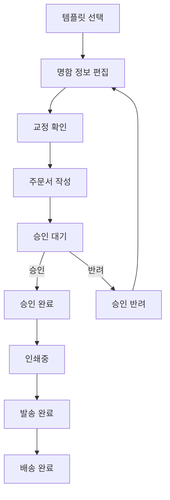

# NCMS 기능정의서

| 항목 | 내용 |
|---|---|
| 문서명 | NCMS (NameCard Management System) 기능정의서 |
| 버전 | v0.1 |
| 작성일 | 2026-07-22 |
| 기준 자료 | Figma Slides 기능정의 21장 및 후속 검토 내용 |
| 개발 스택 | Spring Boot / React / PostgreSQL |
| 배포 구성 | Backend: Railway / Frontend: Vercel |
| 저장소 구성 | 단일 Git 저장소의 `backend`, `frontend` 분리형 모노레포 |
| 문서 상태 | 개발 착수용 초안 |

---

## 1. 문서 목적

본 문서는 기업 임직원의 명함 주문부터 기업 승인, 로그컴의 인쇄·발송까지 이어지는 업무를 신규 시스템으로 구현하기 위한 기능 기준을 정의한다.

Figma 원안의 화면 기능을 기반으로 하되, 신규 시스템 운영에 필요한 고객사·권한·기준정보·상태 이력·보안·인쇄 파일 관리 기능을 보완하여 정리한다.

본 문서는 다음 작업의 기준 문서로 사용한다.

- 화면 및 사용자 흐름 설계
- React 페이지·컴포넌트 설계
- Spring Boot 도메인·API 설계
- PostgreSQL ERD 및 테이블 설계
- 개발 범위와 우선순위 결정
- 테스트 시나리오 및 검수 기준 작성

## 2. 시스템 범위

### 2.1 현재 포함 범위

- 기업 고객사·부서·회원·권한 관리
- 고객사별 명함 템플릿과 상품 옵션 관리
- 임직원의 명함 정보 편집과 실시간 미리보기
- 교정 확인
- 주문 접수
- 기업 관리자의 승인·반려
- 로그컴 운영자의 인쇄·발송 처리
- 주문·승인·상태 이력 관리
- 이메일 알림
- 주문 목록 및 엑셀 다운로드

### 2.2 현재 별도 범위

다음은 Figma 21장에 충분히 정의되어 있지 않으므로 별도 기획 또는 2차 개발 범위로 본다.

- `logcom.co.kr` 일반 고객용 홈페이지 및 비회원 주문
- 일반 고객 카드결제
- 토스페이먼츠 결제·취소
- 고객사 월 정산 및 미수금 관리
- 엑셀 기반 명함 대량 주문
- 택배사 API 자동 배송조회
- 통계 대시보드

## 3. 기본 설계 원칙

### 3.1 멀티테넌트

- 고객사별로 소스를 복제하지 않는다.
- 회원·부서·템플릿·주문 등 고객사 소유 데이터에는 `company_id`를 둔다.
- 기업 사용자와 기업 관리자는 본인 고객사 데이터에만 접근할 수 있어야 한다.
- 로그컴 운영자와 시스템 관리자만 권한 범위 내에서 여러 고객사의 데이터를 조회할 수 있다.

### 3.2 주문 스냅샷

- 주문 완료 시점의 템플릿 버전, 입력 문구, 상품 옵션, 금액, 미리보기 및 인쇄 파일 정보를 고정한다.
- 주문 이후 템플릿이나 가격 정책이 변경되어도 기존 주문 결과는 바뀌지 않아야 한다.
- 재주문은 기존 주문을 복사해 새 주문으로 생성하되 현재 사용 가능한 템플릿과 정책을 다시 검증한다.

### 3.3 이력 우선

- 회원, 주문, 승인, 제작, 배송 관련 중요 데이터는 물리 삭제하지 않는다.
- 사용중지 또는 논리삭제로 처리하고 과거 주문과 감사 이력을 보존한다.
- 상태 변경자, 변경 일시, 변경 전·후 상태, 사유를 기록한다.

### 3.4 권한 분리

- 주문 승인은 기업 관리자 업무다.
- 인쇄 및 발송 상태 처리는 로그컴 운영자 업무다.
- 고객사·템플릿·상품·운영계정 관리는 시스템 관리자 업무다.
- 단순 UI 숨김에 의존하지 않고 백엔드 API에서 권한과 고객사 범위를 검증한다.

## 4. 사용자 역할 및 권한

| 역할 코드 | 역할명 | 주요 권한 |
|---|---|---|
| `EMPLOYEE` | 일반 임직원 | 템플릿 선택, 본인 명함 편집·주문, 본인 주문 조회, 반려 주문 수정, 재주문 |
| `COMPANY_ADMIN` | 기업 관리자 | 소속 고객사의 주문 조회, 승인·반려, 회원·부서 관리, 엑셀 다운로드 |
| `OPERATOR` | 로그컴 운영자 | 전체 또는 배정 고객사 주문 조회, 인쇄 파일 처리, 제작 상태 변경, 송장 등록, 발송 처리 |
| `SYSTEM_ADMIN` | 시스템 관리자 | 고객사·부서·회원·권한·템플릿·상품 옵션·운영계정·정책 관리 |

### 4.1 권한 매트릭스

| 기능 | 임직원 | 기업 관리자 | 로그컴 운영자 | 시스템 관리자 |
|---|:---:|:---:|:---:|:---:|
| 본인 주문 생성·조회 | O | O | 조회 | 전체 |
| 고객사 전체 주문 조회 | X | O | O | O |
| 승인·반려 | X | O | 조회 | 예외 처리 |
| 인쇄중·발송완료 처리 | X | X | O | 예외 처리 |
| 회원·부서 관리 | X | 소속사 | 조회 | 전체 |
| 고객사 관리 | X | X | 조회 | O |
| 템플릿·상품 옵션 관리 | X | X | 운영 조회 | O |
| 시스템 운영계정 관리 | X | X | X | O |

## 5. 전체 업무 흐름



### 5.1 상태 모델

승인 상태와 제작 상태는 각각 관리한다.

#### 승인 상태

| 코드 | 명칭 | 설명 |
|---|---|---|
| `NOT_REQUIRED` | 승인 불필요 | 고객사 정책상 별도 승인이 필요하지 않음 |
| `PENDING` | 승인 대기 | 주문 제출 후 기업 관리자 확인 대기 |
| `APPROVED` | 승인 완료 | 기업 관리자가 승인함 |
| `REJECTED` | 승인 반려 | 기업 관리자가 사유와 함께 반려함 |

#### 제작 상태

| 코드 | 명칭 | 설명 |
|---|---|---|
| `DRAFT` | 편집중 | 주문 제출 전 임시 상태 |
| `RECEIVED` | 접수 | 승인 완료 또는 승인 불필요 주문 접수 |
| `PRINTING` | 인쇄중 | 로그컴이 인쇄 작업을 시작함 |
| `SHIPPED` | 발송 완료 | 택배사·송장번호 등록 후 발송함 |
| `DELIVERED` | 배송 완료 | 배송 완료가 확인됨 |
| `CANCELLED` | 취소 | 허용된 시점에 주문이 취소됨 |

### 5.2 상태 전이 정책

- 승인 반려 시 반려 사유를 필수 입력한다.
- 반려 주문은 주문자가 수정 후 다시 상신할 수 있다.
- 재상신 시 기존 교정 확인은 무효화하고 다시 확인받는다.
- 승인 완료 후 제작 상태를 `RECEIVED`로 전환한다.
- `PRINTING` 이후 일반 사용자와 기업 관리자의 주문 취소를 허용하지 않는다.
- `PRINTING` 이후 취소가 필요한 경우 시스템 관리자 또는 권한 있는 운영자가 사유를 기록해 예외 처리한다.
- 상태를 과거 단계로 임의 변경하지 않으며, 예외 변경 시 감사 로그를 남긴다.

## 6. 기능 정의

### 6.1 인증·계정

| ID | 기능 | 정의 | 우선순위 |
|---|---|---|---|
| AUTH-001 | 로그인 | 아이디와 비밀번호로 로그인한다. 계정 상태·권한·고객사를 확인한다. | MVP |
| AUTH-002 | 권한별 메뉴 | 로그인 사용자의 역할에 따라 접근 가능한 메뉴와 기능을 구성한다. | MVP |
| AUTH-003 | 로그인 유지 | 정책에 따라 인증 상태를 유지하고 만료 시 재로그인 처리한다. | MVP |
| AUTH-004 | 로그아웃 | 현재 인증 정보와 세션 또는 토큰을 안전하게 종료한다. | MVP |
| AUTH-005 | 비밀번호 변경 | 본인 확인 후 비밀번호를 변경한다. | MVP |
| AUTH-006 | 비밀번호 초기화 | 관리자는 비밀번호를 조회하지 않고 초기화 링크 또는 임시 비밀번호를 발급한다. | MVP |
| AUTH-007 | 로그인 실패 제한 | 연속 실패 횟수를 제한하고 일정 시간 계정을 잠근다. | MVP |
| AUTH-008 | 비활성 계정 차단 | 사용중지·퇴사·삭제 처리된 계정의 로그인을 차단한다. | MVP |

#### 보안 정책

- 비밀번호는 최소 8자 이상으로 하고 영문·숫자·특수문자 정책은 운영 협의를 거쳐 확정한다.
- 비밀번호 평문을 저장하거나 목록·수정 화면에 표시하지 않는다.
- 비밀번호는 검증된 단방향 해시 알고리즘으로 저장한다.
- 고객사와 역할 정보는 클라이언트 입력값을 신뢰하지 않고 서버에서 판단한다.

### 6.2 고객사 관리

| ID | 기능 | 정의 | 우선순위 |
|---|---|---|---|
| COM-001 | 고객사 등록 | 회사명, 사이트 코드, 로고, 대표 색상, 담당자 정보를 등록한다. | MVP |
| COM-002 | 고객사 수정 | 고객사 기본정보와 운영정책을 수정한다. | MVP |
| COM-003 | 고객사 사용중지 | 신규 로그인·주문을 차단하되 기존 주문 이력은 보존한다. | MVP |
| COM-004 | 승인 정책 설정 | 고객사별 승인 사용 여부와 승인자 범위를 설정한다. | MVP |
| COM-005 | 기본 배송지 설정 | 고객사 기본 배송지와 수령 정보를 설정한다. | MVP |
| COM-006 | 사용 상품 설정 | 고객사에서 선택 가능한 템플릿·재질·수량을 지정한다. | MVP |
| COM-007 | 고객사 URL 설정 | 사이트 코드 또는 고객사별 접속 경로를 설정한다. | 2차 검토 |
| COM-008 | 정산 방식 설정 | 고객사별 후불·카드·월정산 정책을 설정한다. | 2차 |

### 6.3 부서 관리

| ID | 기능 | 정의 | 우선순위 |
|---|---|---|---|
| DEPT-001 | 부서 등록 | 고객사 하위에 부서를 등록한다. | MVP |
| DEPT-002 | 부서 수정 | 부서명, 상위 부서, 정렬 순서를 수정한다. | MVP |
| DEPT-003 | 부서 사용중지 | 부서를 비활성화하되 소속 회원과 과거 주문은 보존한다. | MVP |
| DEPT-004 | 부서 목록 | 고객사별 부서 계층과 사용 상태를 조회한다. | MVP |

### 6.4 회원·권한 관리

| ID | 기능 | 정의 | 우선순위 |
|---|---|---|---|
| MEM-001 | 회원 목록 | 아이디, 이름, 부서, 권한, 상태 기준으로 회원을 조회한다. | MVP |
| MEM-002 | 회원 등록 | 아이디 중복 확인 후 이름, 부서, 연락처, 이메일, 역할을 등록한다. | MVP |
| MEM-003 | 회원 수정 | 회원 기본정보, 소속 부서, 역할, 사용 상태를 수정한다. | MVP |
| MEM-004 | 회원 사용중지 | 퇴사 또는 이용 중지 회원의 로그인을 차단하고 이력은 보존한다. | MVP |
| MEM-005 | 비밀번호 초기화 | 관리자 화면에서 비밀번호를 표시하지 않고 초기화한다. | MVP |
| MEM-006 | 회원 일괄 등록 | 엑셀 양식으로 회원을 등록하고 오류 행을 안내한다. | 2차 |
| MEM-007 | 변경 이력 | 회원 정보·권한·상태 변경자와 변경 내용을 기록한다. | MVP |

### 6.5 템플릿 관리

| ID | 기능 | 정의 | 우선순위 |
|---|---|---|---|
| TPL-001 | 템플릿 목록 | 템플릿명, 고객사, 상태, 최신 버전을 조회한다. | MVP |
| TPL-002 | 템플릿 등록 | 앞면·뒷면 배경과 기본 속성을 등록한다. | MVP |
| TPL-003 | 템플릿 수정 | 기존 버전을 직접 덮어쓰지 않고 새 버전으로 저장한다. | MVP |
| TPL-004 | 템플릿 복제 | 기존 템플릿을 복제해 새 템플릿 또는 고객사용 변형을 만든다. | MVP |
| TPL-005 | 템플릿 사용중지 | 신규 주문 선택을 차단하고 기존 주문은 유지한다. | MVP |
| TPL-006 | 고객사 배정 | 하나 이상의 고객사에 사용 가능한 템플릿을 연결한다. | MVP |
| TPL-007 | 편집 필드 설정 | 필드명, 위치, 크기, 글꼴, 정렬, 색상, 필수 여부, 최대 글자 수를 설정한다. | MVP |
| TPL-008 | 필드 입력방식 | 고객사 기준정보 선택형 또는 사용자 직접입력형을 지정한다. | MVP |
| TPL-009 | 상품 옵션 연결 | 템플릿별 허용 재질과 주문 수량을 연결한다. | MVP |
| TPL-010 | 버전 조회 | 템플릿 버전별 변경일시와 변경 내용을 확인한다. | MVP |

### 6.6 템플릿 선택

| ID | 기능 | 정의 | 우선순위 |
|---|---|---|---|
| SEL-001 | 사용 가능 템플릿 조회 | 로그인 사용자의 고객사에 배정된 활성 템플릿만 노출한다. | MVP |
| SEL-002 | 앞·뒷면 미리보기 | 템플릿의 앞면과 뒷면을 확인한다. | MVP |
| SEL-003 | 간단편집 진입 | 선택한 템플릿으로 명함 편집을 시작한다. | MVP |
| SEL-004 | 재주문 진입 | 이전 주문 정보를 불러와 새 주문 편집을 시작한다. | MVP |

### 6.7 명함 간단편집

#### 기본 편집 필드

- 한글 이름
- 영문 이름
- 부서
- 직급 1·2
- 한글 주소
- 영문 주소
- 대표전화
- 팩스
- 직통전화
- 휴대전화
- 이메일
- 홈페이지

고객사와 템플릿에 따라 필드의 노출·필수 여부·입력 방식이 달라질 수 있다.

| ID | 기능 | 정의 | 우선순위 |
|---|---|---|---|
| EDT-001 | 필드 입력 | 템플릿 설정에 따라 명함 정보를 입력·선택한다. | MVP |
| EDT-002 | 실시간 미리보기 | 입력값을 앞면·뒷면 미리보기에 반영한다. | MVP |
| EDT-003 | 확대·축소 | 명함 미리보기의 확대·축소를 지원한다. | MVP |
| EDT-004 | 필수값 검증 | 다음 단계 이동 전 필수 필드 입력 여부를 검사한다. | MVP |
| EDT-005 | 형식 검증 | 이메일·전화번호 등 필드 형식을 검사한다. | MVP |
| EDT-006 | 영역 초과 검증 | 텍스트가 출력 가능 영역을 넘으면 경고하고 주문 진행을 제한한다. | MVP |
| EDT-007 | 임시저장 | 편집 내용을 임시저장하고 다시 불러온다. | MVP |
| EDT-008 | 이탈 경고 | 저장하지 않은 변경사항이 있으면 페이지 이탈 전에 경고한다. | MVP |
| EDT-009 | 적용하기 | 입력 내용을 검증하고 미리보기에 확정 반영한다. | MVP |
| EDT-010 | 교정 단계 이동 | 검증 완료 후 교정확인 화면으로 이동한다. | MVP |

### 6.8 엑셀 대량편집·주문

Figma 원안에서 기능이 불명확하므로 MVP에서는 제외하거나 버튼을 숨긴다. 도입 시 다음과 같이 정의한다.

| ID | 기능 | 정의 | 우선순위 |
|---|---|---|---|
| XLS-001 | 양식 다운로드 | 고객사·템플릿에 맞는 엑셀 입력 양식을 제공한다. | 2차 |
| XLS-002 | 엑셀 업로드 | 여러 임직원의 명함 정보를 업로드한다. | 2차 |
| XLS-003 | 행별 검증 | 필수값·형식·길이를 검사하고 오류 행과 사유를 표시한다. | 2차 |
| XLS-004 | 일괄 미리보기 | 정상 데이터의 명함 결과를 주문 전 확인한다. | 2차 |
| XLS-005 | 일괄 주문 | 검증·교정 완료된 여러 명의 명함을 한 번에 주문한다. | 2차 |

### 6.9 교정확인

| ID | 기능 | 정의 | 우선순위 |
|---|---|---|---|
| PRF-001 | 앞·뒷면 확인 | 주문자가 최종 출력 예정 디자인을 확인한다. | MVP |
| PRF-002 | 오탈자 확인 | 명함 문구의 오탈자 확인 항목에 동의한다. | MVP |
| PRF-003 | 연락처 확인 | 웹사이트, 이메일, 전화번호 등 입력 정보 확인에 동의한다. | MVP |
| PRF-004 | 디자인 확인 | 앞면·뒷면 디자인 확인에 동의한다. | MVP |
| PRF-005 | 전체 확인 | 모든 필수 확인 완료 후 다음 버튼을 활성화한다. | MVP |
| PRF-006 | 확인 이력 | 확인자, 확인일시, 명함 데이터, 템플릿 버전, 미리보기 식별자를 저장한다. | MVP |
| PRF-007 | 재편집 처리 | 교정 후 내용을 변경하면 기존 교정 확인을 무효화한다. | MVP |

### 6.10 주문서 작성·접수

| ID | 기능 | 정의 | 우선순위 |
|---|---|---|---|
| ORD-001 | 주문 미리보기 | 주문할 명함의 앞·뒷면과 입력 정보를 표시한다. | MVP |
| ORD-002 | 재편집 | 편집 화면으로 돌아가 내용을 수정한다. 수정 시 교정 확인을 다시 받는다. | MVP |
| ORD-003 | 수령정보 입력 | 수령인 이름, 연락처, 우편번호, 기본주소, 상세주소를 입력한다. | MVP |
| ORD-004 | 주소 검색 | 우편번호 검색을 통해 기본주소를 입력한다. | MVP |
| ORD-005 | 기본 배송지 | 고객사 기본 배송지를 불러온다. | MVP |
| ORD-006 | 상품 옵션 선택 | 허용된 재질과 수량 중 주문 옵션을 선택한다. | MVP |
| ORD-007 | 주문 메모 | 제작·배송 관련 요청사항을 입력한다. | MVP |
| ORD-008 | 주문번호 생성 | 중복되지 않는 주문번호를 생성한다. | MVP |
| ORD-009 | 중복 제출 방지 | 연속 클릭 또는 네트워크 재시도로 같은 주문이 중복 생성되지 않게 한다. | MVP |
| ORD-010 | 주문 제출 | 주문 스냅샷을 생성하고 고객사 정책에 따라 승인 대기 또는 접수 상태로 전환한다. | MVP |
| ORD-011 | 주문 취소 | 허용 상태에서 주문을 취소하고 사유와 이력을 남긴다. | MVP |
| ORD-012 | 가격 표시 | 고객사 계약에 따라 예상 주문 금액을 표시한다. | 정책 확정 필요 |

### 6.11 승인·반려

| ID | 기능 | 정의 | 우선순위 |
|---|---|---|---|
| APR-001 | 승인대기 목록 | 기업 관리자가 소속 고객사의 승인대기 주문을 조회한다. | MVP |
| APR-002 | 주문 상세 확인 | 주문자, 명함 미리보기, 배송지, 상품 옵션, 메모를 확인한다. | MVP |
| APR-003 | 개별 승인 | 한 건의 주문을 승인한다. | MVP |
| APR-004 | 일괄 승인 | 선택한 여러 주문을 일괄 승인한다. | MVP |
| APR-005 | 반려 | 반려 사유를 필수 입력해 주문을 반려한다. | MVP |
| APR-006 | 재상신 | 주문자가 반려 내용을 수정하고 교정 확인 후 다시 상신한다. | MVP |
| APR-007 | 승인 이력 | 승인자·승인일시·반려자·반려일시·반려 사유를 기록한다. | MVP |
| APR-008 | 승인 알림 | 승인 또는 반려 결과를 관계자에게 알린다. | MVP |

### 6.12 주문 조회·상세

| ID | 기능 | 정의 | 우선순위 |
|---|---|---|---|
| QRY-001 | 주문 목록 | 역할과 고객사 범위에 맞는 주문을 조회한다. | MVP |
| QRY-002 | 기간 검색 | 주문일 기준 날짜 범위로 조회한다. | MVP |
| QRY-003 | 조건 검색 | 고객사, 이름, 주문번호, 전화번호, 부서 등으로 검색한다. | MVP |
| QRY-004 | 상태별 조회 | 승인·제작 상태별 탭 또는 필터를 제공한다. | MVP |
| QRY-005 | 페이지 처리 | 대량 주문 목록에 페이지 이동 또는 서버 페이지네이션을 적용한다. | MVP |
| QRY-006 | 주문 상세 | 주문 정보, 명함 데이터, 승인 이력, 상태 이력, 배송 정보를 확인한다. | MVP |
| QRY-007 | 명함 미리보기 | 주문 당시 스냅샷 기준 앞·뒷면을 표시한다. | MVP |
| QRY-008 | 인쇄 PDF 다운로드 | 권한 있는 사용자가 주문 당시 인쇄용 파일을 내려받는다. | MVP |
| QRY-009 | 엑셀 다운로드 | 현재 검색·필터 결과를 엑셀로 다운로드한다. | MVP |
| QRY-010 | 배송 조회 | 택배사와 송장번호를 표시하고 배송조회 링크를 제공한다. | MVP |
| QRY-011 | 재주문 | 기존 주문 정보를 새 편집 초깃값으로 불러온다. | MVP |

### 6.13 재주문

| ID | 기능 | 정의 | 우선순위 |
|---|---|---|---|
| REO-001 | 이전 주문 불러오기 | 기존 주문의 명함 정보와 상품 정보를 불러온다. | MVP |
| REO-002 | 현재 정책 검증 | 템플릿·재질·수량·회원 상태가 현재도 유효한지 검사한다. | MVP |
| REO-003 | 정보 재편집 | 이전 내용을 수정할 수 있도록 편집기에 채운다. | MVP |
| REO-004 | 재교정 | 재주문도 교정확인을 새로 수행한다. | MVP |
| REO-005 | 새 주문 생성 | 기존 주문과 연결 관계를 기록하되 새 주문번호와 스냅샷을 생성한다. | MVP |

### 6.14 인쇄·제작 관리

| ID | 기능 | 정의 | 우선순위 |
|---|---|---|---|
| PRD-001 | 제작대상 목록 | 승인 완료 또는 승인 불필요로 접수된 주문을 조회한다. | MVP |
| PRD-002 | 인쇄 파일 확인 | 주문 스냅샷의 인쇄용 PDF와 파일 버전을 확인한다. | MVP |
| PRD-003 | 인쇄 파일 다운로드 | 선택 주문의 인쇄용 파일을 다운로드한다. | MVP |
| PRD-004 | 인쇄중 처리 | 로그컴 운영자가 제작 시작 주문을 `PRINTING`으로 변경한다. | MVP |
| PRD-005 | 일괄 처리 | 선택한 여러 주문을 인쇄중으로 일괄 변경한다. | MVP |
| PRD-006 | 제작 메모 | 제작 과정의 내부 메모를 기록한다. | MVP |
| PRD-007 | 예외 취소 | 인쇄중 이후 취소가 필요하면 권한자와 사유를 기록한다. | MVP |

### 6.15 배송·발송 관리

| ID | 기능 | 정의 | 우선순위 |
|---|---|---|---|
| SHP-001 | 배송정보 입력 | 배송방법, 택배사, 송장번호를 입력한다. | MVP |
| SHP-002 | 발송완료 처리 | 필수 배송정보 확인 후 주문을 `SHIPPED`로 변경한다. | MVP |
| SHP-003 | 발송 알림 | 주문자와 기업 관리자에게 발송 정보를 알린다. | MVP |
| SHP-004 | 송장 수정 | 잘못 입력한 송장정보를 수정하고 변경 이력을 기록한다. | MVP |
| SHP-005 | 배송조회 링크 | 택배사별 배송조회 페이지로 이동할 수 있게 한다. | MVP |
| SHP-006 | 배송상태 자동조회 | 택배사 API를 통해 배송 상태를 자동 갱신한다. | 2차 |

### 6.16 알림

| ID | 알림 시점 | 수신자 | 우선순위 |
|---|---|---|---|
| NTF-001 | 주문 접수·승인 요청 | 기업 승인자 | MVP |
| NTF-002 | 승인 완료 | 주문자, 로그컴 운영자 또는 운영 메일 | MVP |
| NTF-003 | 승인 반려 | 주문자 | MVP |
| NTF-004 | 인쇄 시작 | 주문자 또는 기업 관리자 | 정책 확정 필요 |
| NTF-005 | 발송 완료 | 주문자, 기업 관리자 | MVP |
| NTF-006 | 주문 취소 | 관련 주문자·승인자·운영자 | MVP |
| NTF-007 | 전송 실패 관리 | 운영자 | MVP |

#### 알림 공통 정책

- 이메일을 1차 알림 채널로 사용한다.
- 알림별 제목·본문 템플릿을 관리할 수 있게 한다.
- 수신자, 발송 시각, 성공 여부, 실패 사유를 기록한다.
- 실패 건은 운영자가 확인하고 재발송할 수 있게 한다.

### 6.17 상품·가격 관리

| ID | 기능 | 정의 | 우선순위 |
|---|---|---|---|
| PRC-001 | 재질 관리 | 명함 재질을 등록·수정·사용중지한다. | MVP |
| PRC-002 | 수량 옵션 관리 | 선택 가능한 주문 수량을 등록·수정·사용중지한다. | MVP |
| PRC-003 | 템플릿 옵션 연결 | 템플릿 또는 고객사별 사용 가능한 재질·수량을 지정한다. | MVP |
| PRC-004 | 가격 정책 | 고객사·템플릿·재질·수량별 가격을 관리한다. | 2차 또는 정책 확정 |
| PRC-005 | 가격 스냅샷 | 주문 시점의 단가, 수량, 공급가, 부가세, 합계를 저장한다. | 결제·정산 도입 시 필수 |

### 6.18 결제·정산

| ID | 기능 | 정의 | 우선순위 |
|---|---|---|---|
| PAY-001 | 월별 주문 집계 | 고객사별 월간 주문과 금액을 집계한다. | 2차 |
| PAY-002 | 정산서 | 월 정산 내역을 화면과 엑셀로 제공한다. | 2차 |
| PAY-003 | 결제 상태 | 결제대기·결제완료·미납·취소 상태를 관리한다. | 2차 |
| PAY-004 | 카드 결제 | 토스페이먼츠를 통해 결제한다. | 2차 |
| PAY-005 | 결제 취소 | 결제 정책과 주문 상태에 따라 결제를 취소한다. | 2차 |

### 6.19 감사 로그

| ID | 기능 | 정의 | 우선순위 |
|---|---|---|---|
| AUD-001 | 로그인 이력 | 성공·실패 로그인과 계정 잠금을 기록한다. | MVP |
| AUD-002 | 권한 변경 이력 | 회원 역할과 고객사 접근범위 변경을 기록한다. | MVP |
| AUD-003 | 주문 상태 이력 | 상태 변경자, 시각, 전·후 상태, 사유를 기록한다. | MVP |
| AUD-004 | 승인 이력 | 승인·반려·재상신 이력을 기록한다. | MVP |
| AUD-005 | 관리자 변경 이력 | 고객사·템플릿·상품 정책의 주요 변경을 기록한다. | MVP |

## 7. 인쇄용 파일 정책

인쇄용 파일은 본 시스템의 핵심 산출물이므로 일반 화면 캡처와 구분한다.

- 인쇄용 PDF 생성 규격을 별도로 확정한다.
- 앞면·뒷면의 페이지 순서, 실사이즈, 도련, 색상, 글꼴 포함 여부를 정의한다.
- 웹 미리보기와 인쇄용 결과의 문구·배치가 일치해야 한다.
- 주문 제출 시 사용한 템플릿 버전과 입력 데이터를 인쇄 파일에 연결한다.
- 인쇄 파일 재생성 시 기존 파일을 덮어쓰지 않고 버전과 생성 사유를 기록한다.
- 운영자가 실제 인쇄에 사용한 최종 파일 버전을 식별할 수 있어야 한다.
- 인쇄 파일 다운로드 권한과 다운로드 이력을 관리한다.

## 8. 주요 데이터 모델

### 8.1 권장 Spring Boot 도메인

```text
auth
company
department
member
template
product
order
approval
production
shipment
notification
settlement
audit
```

### 8.2 PostgreSQL 핵심 테이블

| 테이블 | 주요 목적 |
|---|---|
| `companies` | 고객사 및 운영정책 |
| `departments` | 고객사별 부서 |
| `members` | 사용자 계정과 기본정보 |
| `member_roles` | 사용자 역할 |
| `templates` | 명함 템플릿 기본정보 |
| `template_versions` | 템플릿 변경 버전 |
| `template_fields` | 버전별 편집 필드와 위치·스타일 |
| `company_templates` | 고객사와 템플릿 연결 |
| `product_options` | 재질·수량 등 상품 옵션 |
| `price_policies` | 고객사별 가격 정책 |
| `orders` | 주문 기본정보와 상태 |
| `order_card_snapshots` | 주문 당시 명함 데이터·템플릿·가격 스냅샷 |
| `order_approvals` | 승인·반려 이력 |
| `order_status_histories` | 주문 상태 변경 이력 |
| `print_files` | 인쇄 파일과 파일 버전 |
| `shipments` | 배송방법·택배사·송장정보 |
| `notifications` | 알림 발송 및 실패 이력 |
| `settlements` | 월별 정산 정보 |
| `audit_logs` | 중요 관리자 작업 감사 이력 |

### 8.3 필수 데이터 관계 원칙

- 한 고객사는 여러 부서와 회원을 가진다.
- 한 고객사는 여러 템플릿을 사용할 수 있고 하나의 템플릿도 여러 고객사에 배정할 수 있다.
- 템플릿은 여러 버전을 가지며 주문은 특정 템플릿 버전을 참조한다.
- 주문은 반드시 주문 당시의 명함 데이터 스냅샷을 가진다.
- 주문은 여러 승인·상태 변경 이력을 가질 수 있다.
- 주문은 하나 이상의 인쇄 파일 버전과 연결될 수 있다.
- 배송정보 수정 시 최신 정보와 변경 이력을 함께 보존한다.

## 9. 비기능 요구사항

### 9.1 보안

- 전 구간 HTTPS를 사용한다.
- 서버에서 역할 기반 접근제어와 고객사 데이터 격리를 수행한다.
- 비밀번호, 인증정보, DB 접속정보는 소스에 저장하지 않고 환경변수 또는 안전한 비밀 저장소로 관리한다.
- 개인정보와 주문 파일의 조회·다운로드 권한을 제한한다.
- 회원 목록과 로그에서 비밀번호, 인증 토큰 등 민감정보를 노출하지 않는다.

### 9.2 무결성

- 주문 생성·승인·상태 변경은 트랜잭션으로 처리한다.
- 중복 주문과 중복 상태 변경을 방지한다.
- 주문 스냅샷과 인쇄 파일의 연결 관계를 보존한다.
- 템플릿·고객사·회원이 사용중지되어도 기존 주문 조회가 가능해야 한다.

### 9.3 성능

- 주문 목록은 서버 페이지네이션을 적용한다.
- 검색 조건에 필요한 DB 인덱스를 설계한다.
- 고용량 미리보기·PDF 파일은 DB에 직접 저장하기보다 파일 저장소 사용을 우선 검토한다.
- 고객사·템플릿·주문 건수 증가를 전제로 조회 범위를 제한한다.

### 9.4 운영

- 오류 로그와 주요 업무 로그를 구분한다.
- 이메일 발송 실패를 운영자가 확인할 수 있어야 한다.
- 운영 환경의 DB 백업과 복구 절차를 마련한다.
- 배포 후 DB 스키마는 Flyway 등 마이그레이션 도구로 관리한다.

## 10. 화면 구성 권장안

### 10.1 일반 임직원

```text
/login
/templates
/editor/:templateId
/proof/:draftId
/checkout/:draftId
/orders
/orders/:orderId
/orders/:orderId/reorder
```

### 10.2 기업 관리자

```text
/company/orders
/company/approvals
/company/members
/company/departments
```

### 10.3 로그컴 운영자

```text
/operator/orders
/operator/production
/operator/shipments
/operator/notifications
```

### 10.4 시스템 관리자

```text
/admin/companies
/admin/templates
/admin/products
/admin/prices
/admin/operators
/admin/audit-logs
```

## 11. MVP 범위

### 11.1 1차 오픈 필수

- 로그인·로그아웃·비밀번호 변경·초기화
- 고객사·부서·회원·역할 관리
- 고객사별 데이터 격리
- 템플릿 등록·버전·필드·고객사 배정 관리
- 재질·수량 상품 옵션 관리
- 템플릿 선택
- 명함 간단편집과 앞·뒷면 미리보기
- 필수값·형식·출력 영역 검증
- 교정 확인과 확인 이력
- 주문서 작성·접수·주문번호 생성
- 기업 관리자 승인·반려·재상신
- 주문 목록·검색·상세·상태별 조회
- 주문 당시 스냅샷과 재주문
- 인쇄용 PDF 생성·다운로드·버전 관리
- 인쇄중·발송완료 처리
- 택배사·송장번호 입력과 배송조회 링크
- 이메일 알림과 실패 이력
- 검색 결과 엑셀 다운로드
- 주문·승인·상태·관리자 변경 이력
- 논리삭제 및 사용중지

### 11.2 2차 권장

- 엑셀 기반 회원 일괄 등록
- 엑셀 기반 명함 대량 주문
- 토스페이먼츠 카드 결제·취소
- 고객사별 월 정산·미납 관리
- 택배사 API 배송상태 자동조회
- 통계 대시보드
- 고객사별 독립 URL 또는 고도화된 브랜딩
- 일반 고객용 `logcom.co.kr` 주문 서비스

## 12. 정책 결정 필요사항

개발 전 또는 해당 기능 착수 전 발주사와 확정해야 한다.

| 번호 | 결정 항목 | 주요 선택지 |
|---|---|---|
| P-01 | 고객사 승인 정책 | 전 주문 승인 / 부서별 승인 / 승인 불필요 |
| P-02 | 승인자 범위 | 고객사 전체 / 부서별 / 복수 승인자 |
| P-03 | 주문 취소 가능 시점 | 승인 전 / 인쇄 전 / 관리자 예외만 |
| P-04 | 임시저장 보존기간 | 예: 7일 / 30일 / 무기한 |
| P-05 | 주문 가격 노출 | 주문자 노출 / 관리자만 / 미노출 |
| P-06 | 배송지 정책 | 고객사 고정 / 개인 입력 / 둘 다 |
| P-07 | 인쇄용 PDF 규격 | 크기, 도련, 색상, 글꼴, 앞·뒷면 순서 |
| P-08 | 템플릿 제작 방식 | 관리자 좌표 설정 / 개발사 사전 등록 / 혼합 |
| P-09 | 배송완료 판단 | 운영자 수동 / 택배사 API 자동 |
| P-10 | 이메일 발신 정책 | 발신 도메인, 수신 그룹, 실패 재시도 횟수 |
| P-11 | 개인정보 보존기간 | 회원·주문·배송정보별 보존 및 파기 정책 |
| P-12 | 비밀번호 정책 | 복잡도, 변경주기, 실패 잠금 횟수 |
| P-13 | 엑셀편집 처리 | MVP 제외 / 대량 주문으로 정의해 포함 |
| P-14 | 결제·정산 범위 | 1차 포함 / 2차 분리 / 외부 수기 처리 |
| P-15 | 일반 고객 주문 | 기업 주문과 동시 개발 / 별도 프로젝트 |

## 13. Figma 원안 보완 및 수정사항

1. 회원목록과 수정 화면의 비밀번호 노출을 제거한다.
2. `비밀번호 최대 8자` 정책을 폐기하고 최소 8자 이상의 보안 정책으로 변경한다.
3. `승인관리`, `승인반려` 등 화면별로 다른 명칭을 통일한다.
4. 기업 사용자 화면의 `인쇄중` 변경 기능을 로그컴 운영자 권한으로 이동한다.
5. 회원리스트에 잘못 복사된 주문리스트 설명을 회원 기능에 맞게 수정한다.
6. 주문취소 후 영구삭제 기능을 제거하고 논리삭제·보관 방식을 적용한다.
7. 반려 사유 필수 입력과 조회 기능을 추가한다.
8. 회원 등록에 역할과 부서 선택을 추가한다.
9. 고객사·부서·템플릿·재질·수량 기준정보 관리 화면을 추가한다.
10. 인쇄용 PDF 생성 규격과 파일 버전 관리를 추가한다.
11. 일반 임직원, 기업 관리자, 로그컴 운영자, 시스템 관리자의 역할을 분리한다.
12. 승인 상태와 제작 상태를 분리해 권한 충돌을 방지한다.

## 14. 핵심 검수 기준

### 14.1 권한·데이터 격리

- 일반 임직원은 다른 사용자의 주문과 관리자 메뉴에 접근할 수 없어야 한다.
- 기업 관리자는 다른 고객사의 회원·주문을 조회하거나 변경할 수 없어야 한다.
- 주소를 직접 입력하거나 API를 호출해도 서버에서 권한 위반을 차단해야 한다.

### 14.2 편집·교정

- 입력한 문구가 앞·뒷면 미리보기에 정확히 반영되어야 한다.
- 필수값 누락, 형식 오류, 출력 영역 초과 시 다음 단계로 진행할 수 없어야 한다.
- 교정 완료 후 내용을 수정하면 교정 확인 상태가 해제되어야 한다.

### 14.3 주문·승인

- 주문 연속 클릭과 재요청에도 동일 주문이 중복 생성되지 않아야 한다.
- 반려 시 사유 없이 처리할 수 없어야 한다.
- 반려 주문 수정·재상신 시 이력이 모두 보존되어야 한다.
- 주문 당시 템플릿과 명함 정보가 이후 기준정보 변경의 영향을 받지 않아야 한다.

### 14.4 제작·배송

- 기업 관리자는 인쇄 상태를 변경할 수 없어야 한다.
- 인쇄중 이후 일반 취소가 차단되어야 한다.
- 발송완료 처리에는 택배사와 송장번호 등 필수값 검증이 적용되어야 한다.
- 송장 수정 전·후 값과 수정자가 기록되어야 한다.

### 14.5 인쇄 파일

- 웹 미리보기와 인쇄용 PDF의 문구·배치가 일치해야 한다.
- 주문 상세에서 실제 인쇄에 사용한 파일 버전을 식별할 수 있어야 한다.
- 템플릿 수정 후에도 과거 주문의 인쇄 파일과 스냅샷이 유지되어야 한다.

## 15. 문서 변경 이력

| 버전 | 일자 | 변경 내용 |
|---|---|---|
| v0.1 | 2026-07-22 | Figma Slides 21장 및 개발 관점 보완사항을 통합해 최초 작성 |
